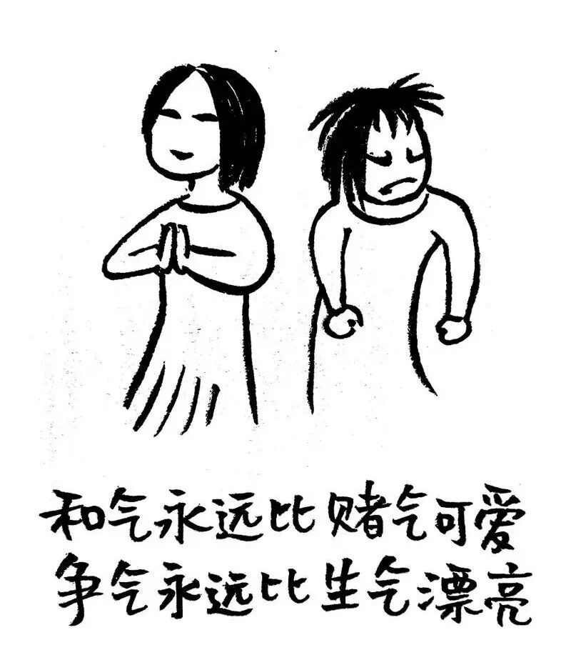
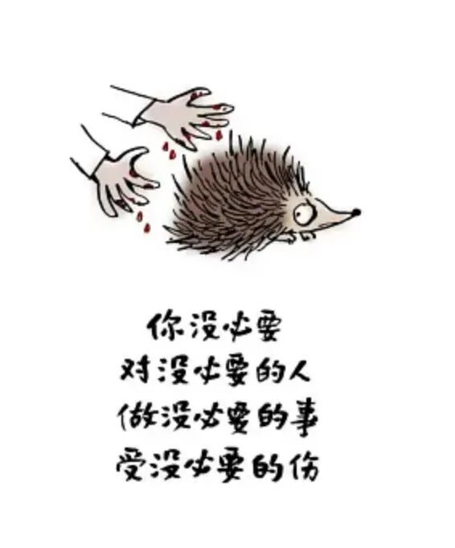
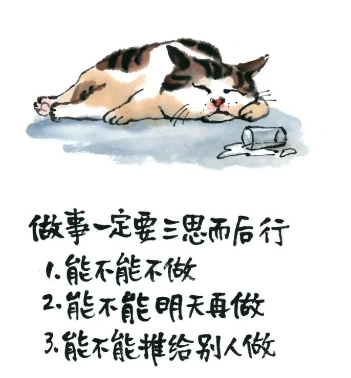

# 小林漫画：少生气，多福气

- 原文链接：<https://mp.weixin.qq.com/s/zy02vbaazKnU8KT7f8E8vg>
- 归档时间：`2026-08-20T17:21:38.992623+08:00`
- 归档范围：已清理署名、二维码、广告、推广和无关装饰后的原文正文。

## 原文正文

01

老公带孩子玩游戏时

把牛奶洒在新沙发上

我刚要发火

他俩小心翼翼的看着我

我说

“没事，沙发本来就该洗了”

他破涕为笑

我少生一次气

多活五分钟

原始图片链接：<https://mmbiz.qpic.cn/sz_mmbiz_jpg/UVsZ2xn51XJ4Q3o0V6DCS6ZwbtKOzZsG6qApGEYlEmyFSO1purowndsghsLzIpCAqRQdZOHUcIqkqRpicbFDibiaWZ8tKmdEdJzjYwPia7hNXR4/640?wx_fmt=jpeg>

02

排队被人插队

我正要理论

一看是个抱孩子的妈妈

我让了

她回头说谢谢

我说“不客气，反正我也不急”

其实急

但急也不差这五分钟

孩子在学校被老师批评

回来跟我哭

我本想找老师理论

后来问清是他上课说话

自己理亏

不气了

陪他一起分析问题

原始图片链接：<https://mmbiz.qpic.cn/mmbiz_jpg/UVsZ2xn51XL0SlfRaE44hwNy9jPf8mahic5nctS7icou831R8DeztICB1zRE58534QwLMSnuz1hNEg5dk46I7DuO2gqhMFpdbckNBo1nWdFdw/640?wx_fmt=jpeg&from=appmsg>

03

生气

是用别人的错误惩罚自己

不生气

是把别人的错误当笑话看

笑一笑

十年少

少生气

多福气

福气来了

谁还记得那些破事

原始图片链接：<https://mmbiz.qpic.cn/mmbiz_jpg/UVsZ2xn51XKGEerZiapSbowgyBsEPBd6lWVhH9ZLxAhrHCJWyWW23PRYMJKZgfbe41E2U39AM84pAvuvVGRZXCicRMaic9kDY1XicIiakVibTMoX8/640?wx_fmt=jpeg&from=appmsg>
