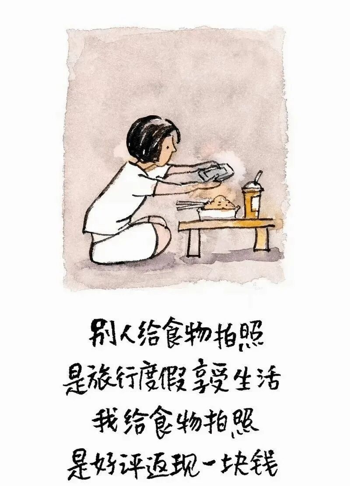
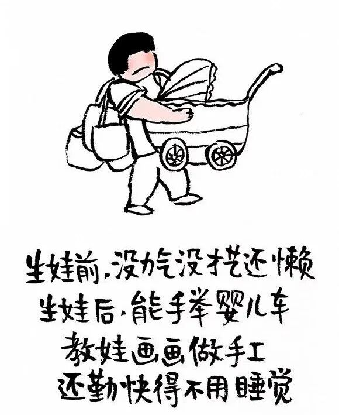

# 小林漫画：中年少女的婆媳相处之道

- 原文链接：<https://mp.weixin.qq.com/s/j_NGLRR0MfuROtdqphmDJQ>
- 归档时间：`2026-08-20T17:55:00.830172+08:00`
- 归档范围：已清理署名、二维码、广告、推广和无关装饰后的原文正文。

## 原文正文

01

买菜这件小事，差点让我原地辞职。

第一次跟婆婆去买菜，我差点怀疑人生。她能为一块钱和摊主聊三分钟，我在旁边只想扫码走人，节奏完全不在一个频道。

她觉得，买菜是生活，是精打细算；我觉得，买菜是任务，是效率优先。她慢慢挑，我越看越急。一个在过日子，一个在赶时间。

后来我学会分工，她负责挑，我负责拎。节奏不一样，就别硬拉同步。生活不是比赛，没必要谁赢谁输。能一起回家，就是最好的结果。

原始图片链接：<https://mmbiz.qpic.cn/sz_mmbiz_jpg/UVsZ2xn51XLWufwqUN0DKkImy6qZSGuNicFyrtR5QcOSjgNDicZdN6Cktm7eibBHlZ9qIia8sFNmKbtEJkicUic5Z55IwdrZwRDaHVB6dYNnJO5qo/640?wx_fmt=jpeg>

02

带娃这件事，没有标准答案。

她说孩子要多穿一件。你说现在温度刚好。两个人围着一个孩子，像在打辩论赛，谁都觉得自己更科学。

她用经验带娃，你用知识带娃。她相信“以前都这么养大的”，你相信“专家都这么说的”。孩子还没长大，大人先累了。

后来你发现，孩子其实没那么脆弱。方法不同，不代表有对错之分。选一个主方案，留一点弹性。家庭不是实验室，是慢慢长大的地方。

原始图片链接：<https://mmbiz.qpic.cn/mmbiz_jpg/UVsZ2xn51XKY3pW1vskjOLQb6sOdvsUMct1JcZibInGtzlyib7ohGTGOpk6uN5qZQeBFjIJA5Fqp02Tr494SB46vx4R4oB2wLxiczW4qglo48w/640?wx_fmt=jpeg>

03

做饭这件事，厨房就是江湖。

你做饭讲究少油少盐，她做饭讲究味道到位。同一道菜，两种做法，空气里都在暗暗“较劲”。

她觉得你吃得太清淡，你觉得她下手太豪放。你想改，她不习惯，厨房成了最容易有火花的地方。

后来你们各做各的，偶尔交换尝一口。你开始理解她的“下饭”，她也慢慢接受你的“清淡”。味道不一样，但一桌饭更热闹了。

原始图片链接：<https://mmbiz.qpic.cn/sz_mmbiz_jpg/UVsZ2xn51XJQfDmV6twIhJvjL0Qqbcj0BC9JA0Ea0UXBCx99md3OKRy9ZHEjgRAmicmvAkCIsic579ico9jD8aGFEDqib6F1TwqeCXiat3NNl6qY/640?wx_fmt=jpeg>
