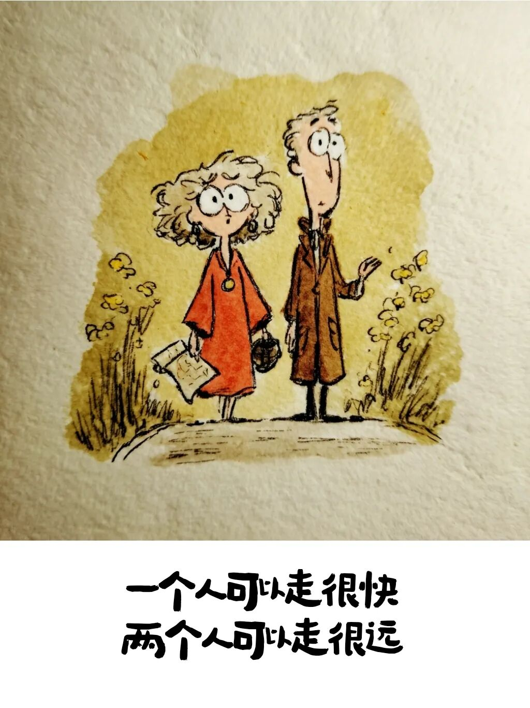
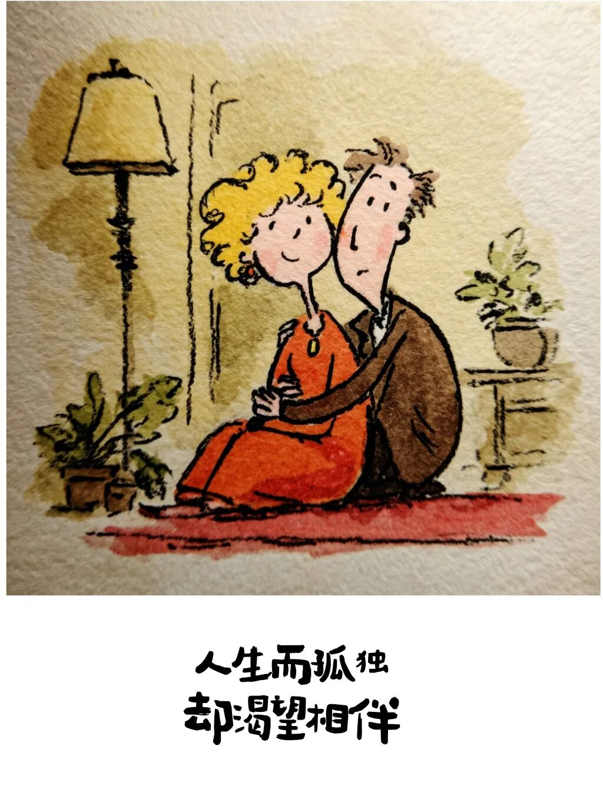
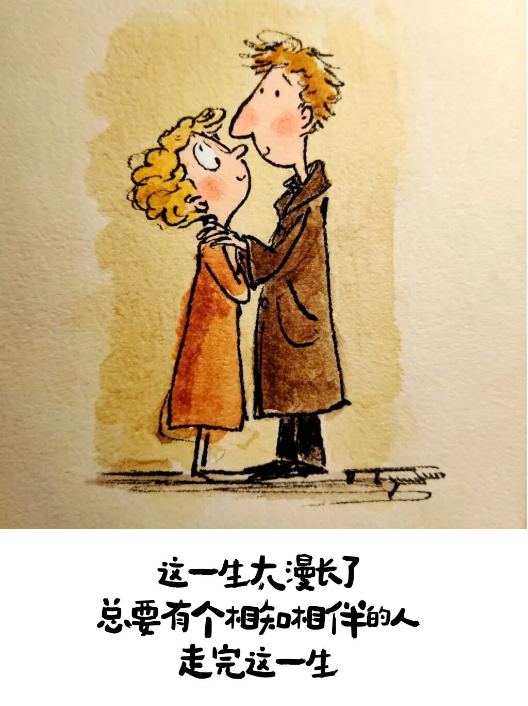

# 结婚的意义是什么？这是我听过最好的回答

- 原文链接：<https://mp.weixin.qq.com/s/eq_5ZrJLksPnfCNKrZUcVQ>
- 归档时间：`2026-08-20T17:56:19.915705+08:00`
- 归档范围：已清理署名、二维码、广告、推广和无关装饰后的原文正文。

## 原文正文

1

以前总以为

结婚是为了轰轰烈烈的爱情

是为了盛大的仪式

旁人的祝福

是到了年纪该完成的人生任务

后来历经生活琐碎

看过聚散离合才明白

婚姻从不是爱情的终点

而是成年人一起选择的结伴修行

原始图片链接：<https://mmbiz.qpic.cn/sz_mmbiz_jpg/UCVnfYLyn8XFzBJDlDKZaP4cqaAamXXgzJBD5CjOxibicDCkh37VUwCvHVaicECWdgGc3hHYt1BWq5vcAh7pps3JibvBKvhfAPf2Btria9Ub9gyk/640?wx_fmt=jpeg>

2

结婚真正的意义

不是搭伙过日子

也不是为了传宗接代

而是在漫长枯燥的人生里

你多了一个坚定的同盟

开心的时候

有人分享喜悦

难熬的时候

有人并肩撑腰

替你分担风雨

世间万般辛苦

你不再是孤身一人对抗人间疾苦

原始图片链接：<https://mmbiz.qpic.cn/mmbiz_jpg/UCVnfYLyn8VoibKvnrRuDibZJuziaN1Pk9yWnVTw77FesjDJn7NlyBE12yX00HLusSyLXsUMQYzawuq48IKcAQiaPZnAnZLvwmtyNen2Mlu71q0/640?wx_fmt=jpeg>

3

好的婚姻

是情绪的归宿

是生活的底气

是哪怕看透了彼此的平凡与不完美

依然选择包容 选择坚守

是低谷时有人托底

迷茫时有人指引

疲惫时有人知你冷暖

懂你不易

不用刻意伪装坚强

不用事事独自硬扛

在这个人身边

你可以安心脆弱

可以永远自在坦荡

4

人这一生

独行注定孤寂

结伴方能远行

婚姻最好的模样

不是一生轰轰烈烈

而是一生平平淡淡

有人问你粥可温

有人与你立黄昏

岁岁年年 互为依靠

这就是结婚的意义

原始图片链接：<https://mmbiz.qpic.cn/sz_mmbiz_jpg/UCVnfYLyn8XewcxozOONMfX8Y8wx0cUcfLunKNWMVnGbwLtU2FCypNpbpKUABcKPJLCrHsPwv9djnPaz1JHB7Ut5RzKe4EWQCFkibAq0zC2w/640?wx_fmt=jpeg>
