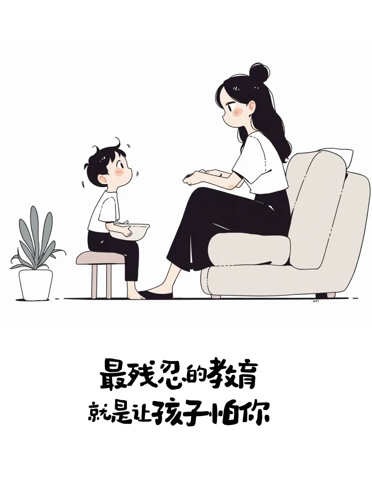
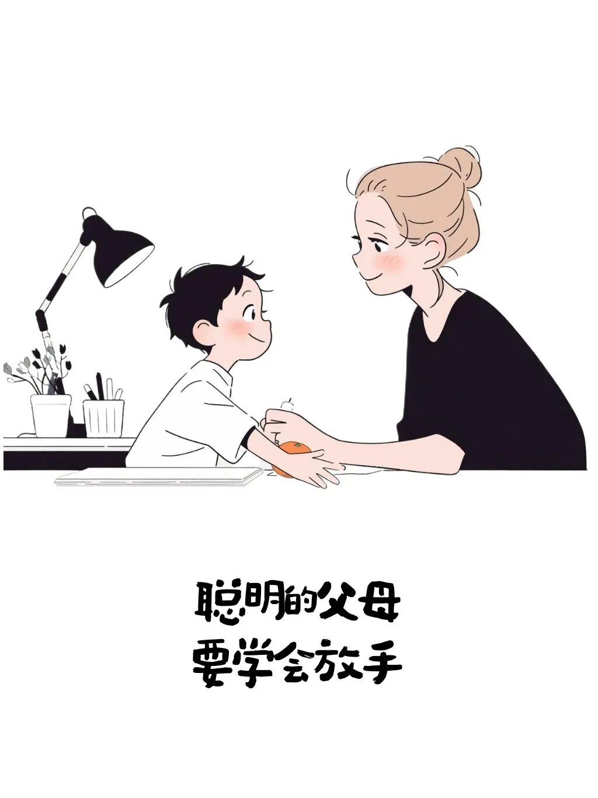
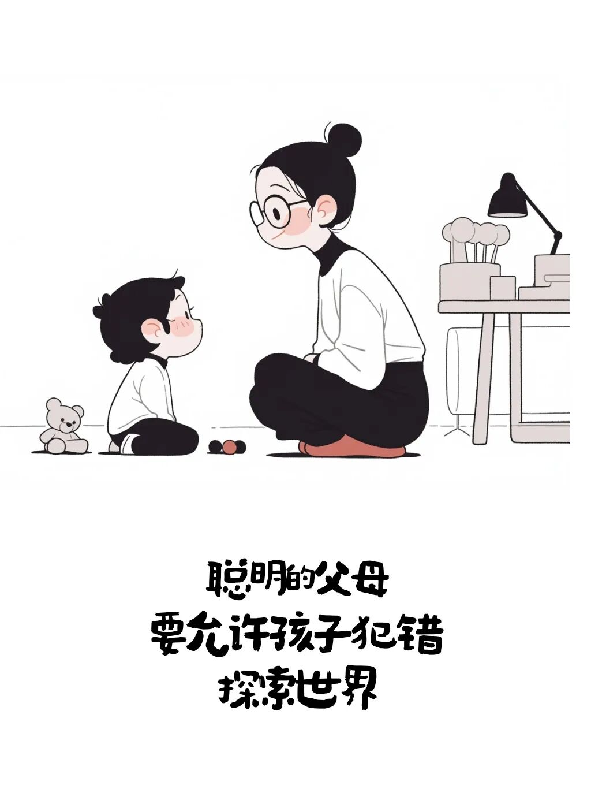
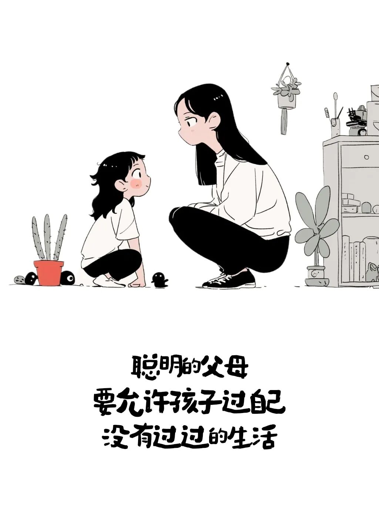

# 不要成为孩子的第一个霸凌者

- 原文链接：<https://mp.weixin.qq.com/s/6O9w-wVpRLF1pGE5LPd4pg>
- 归档时间：`2026-08-20T14:23:11.694144+08:00`
- 归档范围：已清理署名、二维码、广告、推广和无关装饰后的原文正文。

## 原文正文

1

很多父母从未意识到

孩子的自卑 敏感 怯懦和讨好

都源于原生家庭的伤害

父母往往是孩子的第一个霸凌者语言打压 情绪宣泄 无端指责

居高临下的控制

日复一日

悄悄摧毁孩子的底气与人格

原始图片链接：<https://mmbiz.qpic.cn/sz_mmbiz_jpg/UCVnfYLyn8WoyniaXJ98GAvjUY0Ey2HibLIibWj7Mg1QZr7vAty5FI1riaIAHl7OUhX5ibfvSziaayNdAC9VqjRDMKEVM8FAH5gQFtEtLTc5ZictnQ/640?wx_fmt=jpeg>

2

一点点小事就否定孩子

习惯性泼冷水 贴标签 翻旧账

你以为是严格管教

在孩子眼里

却是无尽的否定与羞辱

父母的每一句

怎么这么笨

早知道不生你

都是一把无形的刀

慢慢磨掉孩子的自信

让他从小活在自我怀疑里

原始图片链接：<https://mmbiz.qpic.cn/sz_mmbiz_jpg/UCVnfYLyn8VUw1wOPUdXJnb7etL2ibGVyxIlveoUhQiaiahRmwOibNejV3OnUkGmKD0OUH1HOetkv9gM4FRlhyKpDVCvnemS4FD727l2khhpztQ/640?wx_fmt=jpeg>

3

很多家长以为你好为名

控制孩子的选择

压抑孩子的情绪

否定孩子的喜好

不允许反驳 不允许犯错

不允许有自己的想法

稍不顺从就言语压制

长期被霸凌式养育的孩子

要么变得懦弱自卑 唯唯诺诺

要么极度叛逆 暴躁极端

童年受过的伤

需要一生去治愈

原始图片链接：<https://mmbiz.qpic.cn/sz_mmbiz_jpg/UCVnfYLyn8XyHBK6aByT15dPyEW7uJc77Emm3YhjfVfplQXfsxrPzkHPU2JsSBz3HicKQGKib33496mJn6ibhmHAIj0e9kljAZvRMmCLOYqibL4/640?wx_fmt=jpeg>

4

养育的本质是是托举

不是控制

为人父母

收起情绪 放下强势

停止语言伤害

多一点包容 理解与温柔

家庭应该是孩子最安全的避风港

而不是伤他最深的战场

别让你的教育

成为孩子一生的阴影

别让自己

成为孩子人生里第一个霸凌者

原始图片链接：<https://mmbiz.qpic.cn/mmbiz_jpg/UCVnfYLyn8Wa561W5H56n0VsFmMx75p3qQwYhnXE5H1607QP0bRmibdD5V6txUQfufbTbsm02A90ZhDjQ7gzgDvcHoVUK81ke4xvhrYojoqE/640?wx_fmt=jpeg>
