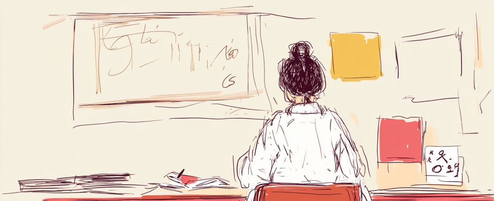
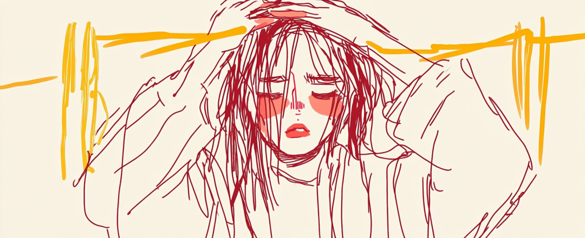
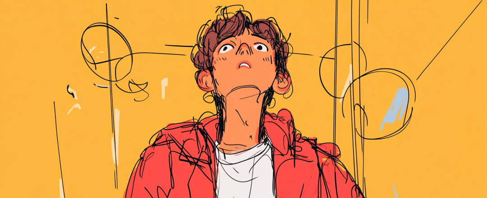
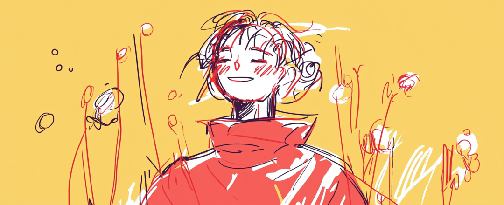

# 如果你也总帮别人找理由。

- 原文链接：<https://mp.weixin.qq.com/s/KRfR_dZNqf4XnkGuyJdNfw>
- 归档时间：`2026-08-28T16:48:34.791976+08:00`
- 归档范围：已清理署名、二维码、广告、推广和无关装饰后的原文正文。

## 原文正文

曾经当过几年语文老师。

教到"虽然…但是…"这组关联词时，

我会说：

“后半句才是真正要说的话。”

原始图片链接：<https://mmbiz.qpic.cn/sz_mmbiz_png/IsrFAFPlrN7Xq45J54k7ADZJceeJkfvJdlOcUx7iayqql8kD0tLPIibnC6bPNfMPibWR7iciaUuPT8988GF3CTWSe2A/640?wx_fmt=png&from=appmsg>

某天深夜，改完作文瘫在沙发上时，我心想：

"虽然累得快散架，但是明天还要七点起床。"

"虽然心里堵得慌，但是对方平时对我挺好的。"

说的时候，

我很不爽。

但又不知道怎么了。

原始图片链接：<https://mmbiz.qpic.cn/sz_mmbiz_png/IsrFAFPlrN7Xq45J54k7ADZJceeJkfvJXSvl8EiafPzeOgbNWBAWZD5qgWdhTGcibHb01VCEf8lz3byNldP97WsA/640?wx_fmt=png&from=appmsg>

直到有天，我讲课又重新讲这个知识点，站在讲台上，心怦怦直跳。

我才发现——

我教学生，把重点放在「但是」后面。

而我的「但是」后面，

放的从来不是自己。

"虽然累得快散架，

但是明天还要七点起床。"

"虽然心里堵得慌，

但是对方平时对我挺好的。"

我总在用“但是”，

给除了我以外的人让路。

每个忽视自己的人，

内心明明是不爽的，

却会用各种理由，

去完成「正确的逻辑链」。

这也就是我们说的“自洽”。

但自洽太久，

反而会忘记自己想要的是什么。

原始图片链接：<https://mmbiz.qpic.cn/sz_mmbiz_png/IsrFAFPlrN7Xq45J54k7ADZJceeJkfvJVhuYcj2XX0uTTrFWDQXqZibc7QPYffoYfsMS5pibz7ZViaaveDMiaNP89A/640?wx_fmt=png&from=appmsg>

所以我会建议，改变句式，学会重新与自己对话：

"虽然要加班，但是我的身体需要休息。"

"虽然他是好人，但是我的感受也需要被看见。"

"虽然要顾全大局，但是此刻我真的撑不住了。"

我们太擅长用「但是」为别人找理由。

却忘了在转折处，

先听见自己的声音。

学会在「但是」后面先安放自己，

生活才开始有了真正的选择权。

原始图片链接：<https://mmbiz.qpic.cn/sz_mmbiz_png/IsrFAFPlrN7Xq45J54k7ADZJceeJkfvJpMX8HjS2bdXxPs1OibmUolQUE5WYUsEiaWz3coj5H1t5C7TI94JiaqhsA/640?wx_fmt=png&from=appmsg>
