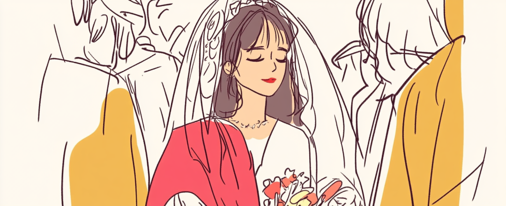
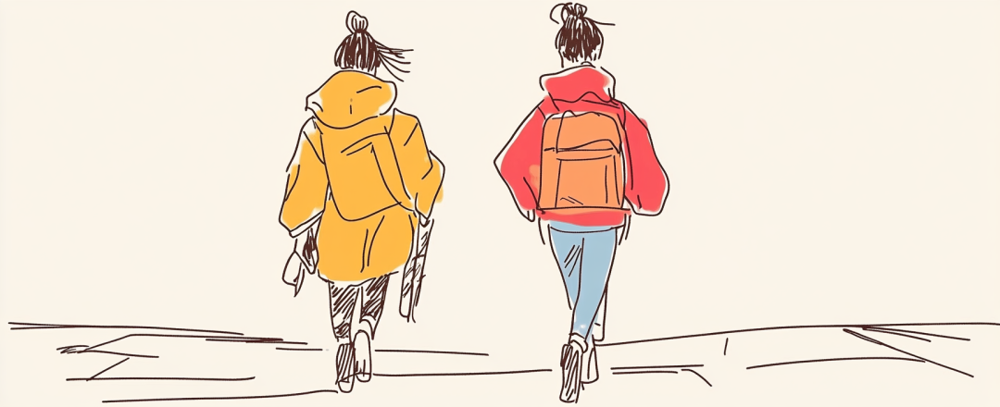
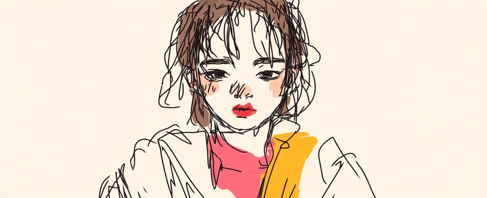
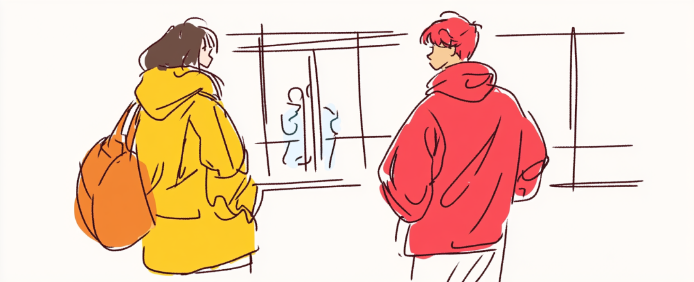
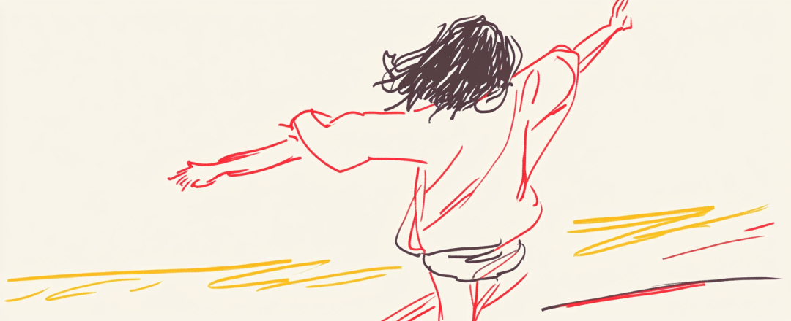

# 当你最好的朋友结婚了

- 原文链接：<https://mp.weixin.qq.com/s/trzyKXLkHstYWvn0M6fyGQ>
- 归档时间：`2026-08-28T16:39:16.424939+08:00`
- 归档范围：已清理署名、二维码、广告、推广和无关装饰后的原文正文。

## 原文正文

最近发现一件挺矛盾的事——

好朋友的人生大事，反而最考验友情。

原始图片链接：<https://mmbiz.qpic.cn/sz_mmbiz_png/IsrFAFPlrN5vDLdKSOkHGFOQqXbaMe436Uw1fXFZzWqQoiaBJIEbNfRypEKaxv1IvZYxUiciakLt6EXMnxCQQDXPQ/640?wx_fmt=png&from=appmsg>

一。

那天，我突然收到好朋友即将结婚的消息。

明明我该为她开心，

心里却冒出一句——

“以后她再也不是我一个人的朋友了”。

我们两个从初中开始便形影不离。

即使没有在同一个地方读大学和工作，

也暗自庆幸网络和年假的存在，

能让我们保持着舒服又亲密的联络。

我点开订婚的视频，看她捂着嘴笑说他们的第一次见家长，决定结婚的心情。

在那之前，我有在电话里头听到她夸奖对方的浪漫贴心：“缘分来了是这样的。”

我曾以为距离割不断关系，此时，却真切感受到——

距离会隔断细节。

很多事情，已经不需要我知道。

原始图片链接：<https://mmbiz.qpic.cn/sz_mmbiz_png/IsrFAFPlrN5vDLdKSOkHGFOQqXbaMe43bP1wyUuM20VcpsDD3ibAqlFUresvjXUhEW4PRRlPs3ickNic8CUf9Zepw/640?wx_fmt=png&from=appmsg>

二。

订婚之后，朋友便忙着备婚。

或许是太习惯每件事情，绑定彼此的参与，

当我向她发去国外双人游的优惠价格，

在聊天框打上“有没有兴趣?”，

这句话还没发送过去，

紧接着，她发来开心的表情包：

“这不错，适合跟我老公度蜜月。”

我意识到——

那断开的细节，不仅意味着不需要我知道，也可能代表着不需要我。

原始图片链接：<https://mmbiz.qpic.cn/sz_mmbiz_png/IsrFAFPlrN5vDLdKSOkHGFOQqXbaMe43dU3fVF9zbK9gCfl2XCb7cPuzIbPwURVDhEJPbjhVictScevG9jADfOQ/640?wx_fmt=png&from=appmsg>

往上滑动聊天记录，我们聊的事情越来越不一样。

我找她聊的，是工作，是独居生活。

她找我谈的，是帮她选金镯子，未来婚房的布置。

我们两个人的生活状态全然被切开。

可是以前，不是这样的。

我想起高三那会，突然胃疼，绞成一团，疼到我直冒冷汗。

在分秒必争的高三数学课，我不敢举手，后来实在疼得叫出声。

她坐在前排听到我的声音，举手告诉老师，她要陪我去医务室。

她看出我的歉意：“题目我都做对了，没事，没你身体重要。”

我一直在抗拒——

我不再成为她人生优先级的事实。

逐渐承认自己被排在她人生进程之外的失落感。

三、

可我还是觉得哪里怪怪的。

因为这也不是我身边第一个好朋友结婚。

当我去超市买东西准备结账，

看到一对夫妇在收银台。

因为推车里多放一瓶洗发水在争吵，引来不少路人围观。

我脑海里涌现的是，万一她的老公也这么对她，该怎么办。

我努力让自己挥散这消极的想法。

我快速逃离那对夫妇争吵的场景。

而是，如果真的发生这样的事情，我该怎么做。

原始图片链接：<https://mmbiz.qpic.cn/sz_mmbiz_png/IsrFAFPlrN5vDLdKSOkHGFOQqXbaMe43FDQurDZTkBfcVGoibO98LVSBXq112ISdriaRuOrsvRtfolaZM2swddfA/640?wx_fmt=png&from=appmsg>

大学放寒假，她跟初恋分手，打电话抽泣：“过来陪陪我。”

即便全情的陪伴，我也知道，我的帮助微乎其微。

很长一段时间，都是靠她自己，才彻底走出来失恋的阴影。

我明朗心中不对劲的感觉，婚姻问题远比失恋复杂得多。

我怕她过得不幸福，也害怕她的不幸福向我求助。

我却无能为力去满足她的需要。

一想到这，我的后背些许发凉。

我们同步彼此的人生太久了，久到我习惯性地用过去的方式去维系关系。

共同对抗的失恋、生病、考试，这种"共患难"的经历形成对友情的错觉——

只有互相替对方解决问题，才能算是好朋友。

可是人会长大，步伐不一致，困境会变得复杂。

萌生她在婚姻里的焦虑，

实际上是——

我不知道该把自己放在哪个位置，

才能确保这段亲密关系能继续下去。

她给我寄了喜糖到公司。

是现做的潮汕特色糖，超大一份，有鸡蛋酥，瓜子糖，花生糖和黑芝麻。

我把她送来的喜糖分享给公司的同事，大家都说好吃，

我向她转达，她很开心，说喜欢就好。

“我交代过老板多放瓜子糖，你自己吃多点，再去分给别人。”

她还记得我最爱吃的是这个口味，也是这句话，让我觉得，她变了，又没变。

我一直在内心翻山倒海，

却忘记去相信——

她是无论生活怎么样，

都能把自己过得很好的人。

原始图片链接：<https://mmbiz.qpic.cn/sz_mmbiz_png/IsrFAFPlrN5vDLdKSOkHGFOQqXbaMe43wPZ9jbbuhicVlMQliam9Q66Y686WG4cGqoRIZ2uGTFht5epPRkvDOcow/640?wx_fmt=png&from=appmsg>

即使翘课陪我去看医生，

她的成绩仍遥遥领先。

即使失去曾经重要的感情，

她捣鼓做慕斯和练习给人做美甲。

她人生的优先级，不是我，不是她老公，

而是她。

她确保自己的幸福之后，才会去向外分享。

如今，她很快乐，沉浸在新生活里，

我不再去纠结，学着放下提前的焦虑，

我能做的就是在她迈入新阶段的时候，

学会怎么重新做她的朋友。
