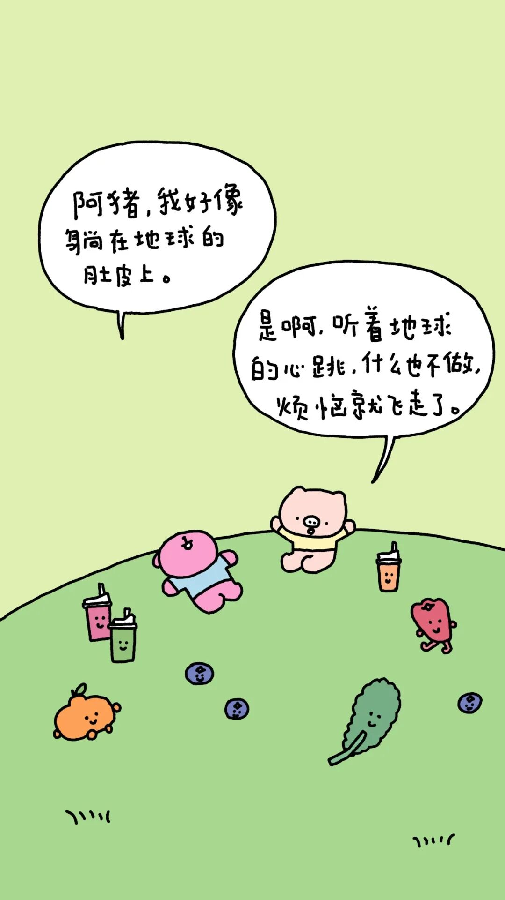
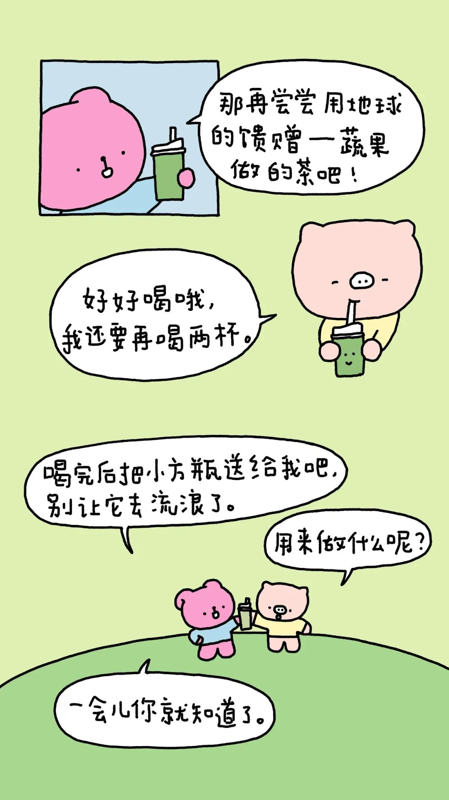
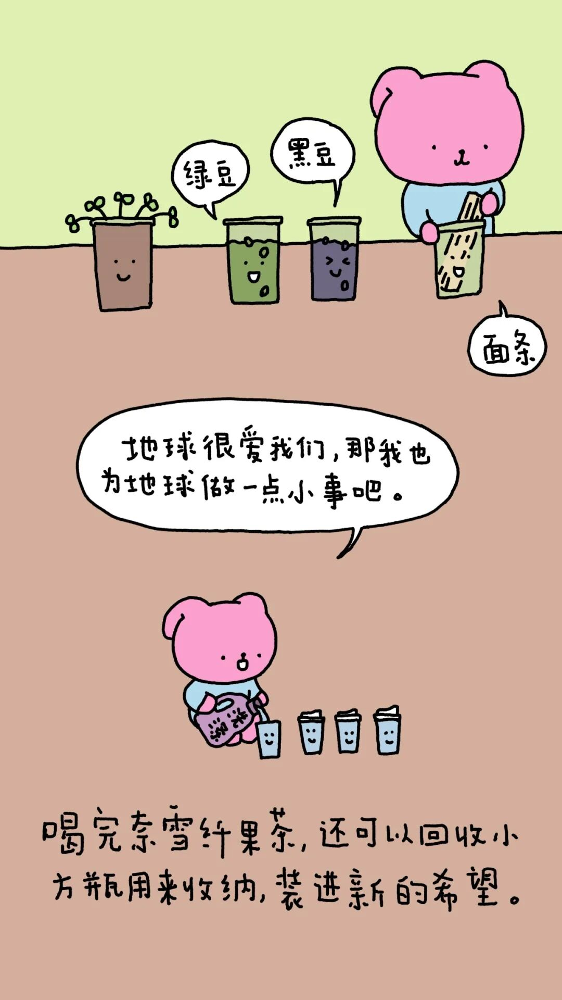
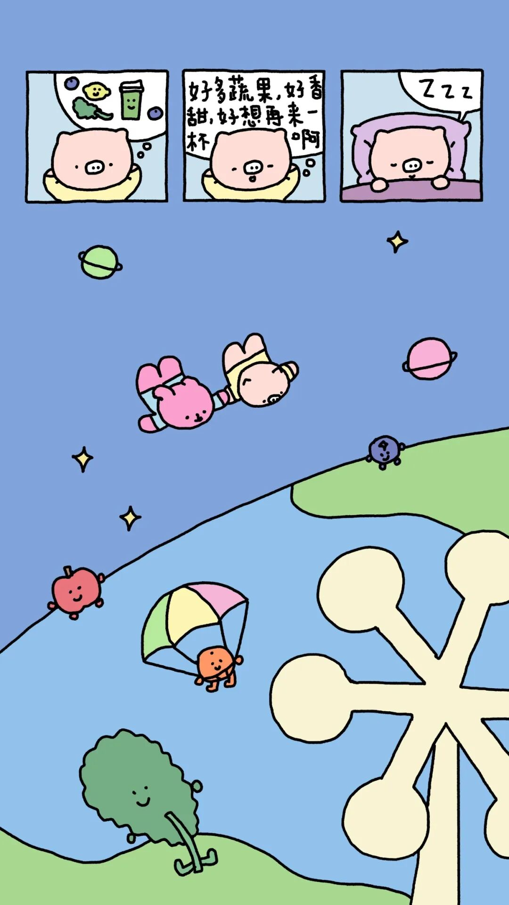
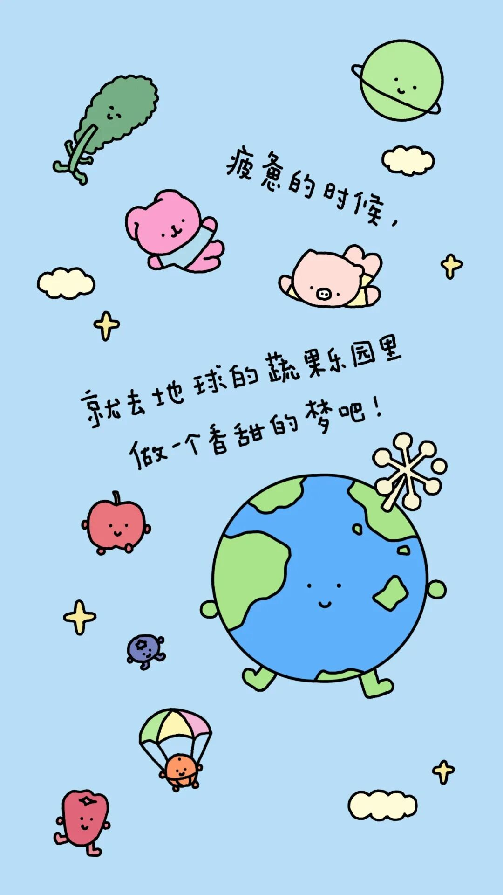

# 今天的我 会比昨天更爱你

- 原文链接：<https://mp.weixin.qq.com/s/QQEdjnUEwYPDQfG5CQ151A>
- 归档时间：`2026-08-28T16:12:30.211455+08:00`
- 归档范围：已清理署名、二维码、广告、推广和无关装饰后的原文正文。

## 原文正文

原始图片链接：<https://mmbiz.qpic.cn/sz_mmbiz_jpg/d8E4Hv0lf2VnQdibX0nINCuh2Yvzq5AOgayKXVD127FsmerTO9OTUbaZyD3hn1UbD4N0ead8B2HzfjllS7IIvD8CBFou4ccrAC15TS34e53M/640?wx_fmt=jpeg&from=appmsg>

原始图片链接：<https://mmbiz.qpic.cn/sz_mmbiz_jpg/d8E4Hv0lf2XAteE7CujAwY748KpTmWKM9m4nQAG34TIUkUjart9p0WkP2qljJHkq3wO6nA7WjuWRoJofdzgHJuEe6yZCS1MQJWYKXnDfrdg/640?wx_fmt=jpeg&from=appmsg>

原始图片链接：<https://mmbiz.qpic.cn/sz_mmbiz_jpg/d8E4Hv0lf2WfNy2j2oNNicwGxibKbc7E0ibnic3ZicKpIhZJT8TBnnBpgeINOqqQUq8KJnpgqdkNzbceMllOnlZhVRiaubKF7k9zjEBqPicwGyMTlU/640?wx_fmt=jpeg&from=appmsg>

原始图片链接：<https://mmbiz.qpic.cn/sz_mmbiz_jpg/d8E4Hv0lf2VB5v0ECpOAchesAIrvpq4rozKS7ibTHpthzu8Esibbic4HLqmew7qDGvI7tvZcF3U7fw7wt4icClwjTGPAAzm2aDpy6K2HKULu8TI/640?wx_fmt=jpeg&from=appmsg>

原始图片链接：<https://mmbiz.qpic.cn/sz_mmbiz_jpg/d8E4Hv0lf2VibMAJ3eIIvZEicu4DJVbxklJuZyibLdR1JWiaaPk1E39ibGCp9jSmFXIy2kufCsxxbZlfz67gnxeN0Y2DtGW4SRV2chduIRRl0rpE/640?wx_fmt=jpeg&from=appmsg>

美好的春天，拟泥nini和新朋友奈雪的茶有了新联动！

在世界地球日这一天，阿猪阿兔停下匆忙的脚步，躺在地球的肚皮上，品尝着美味的奈雪纤果茶。用小方瓶装下绿色的种子，用心守护赖以生存的家园。

加入奈雪纤果茶-小方瓶计划,为美丽的地球做一件小事，把环保习惯融入每一天。随手关灯断电节约能源，双面用纸减少林木消耗，做好垃圾分类，绿色出行……

亲爱的地球，今天的我，比昨天的我，更爱你一些。

除了健康又美味的奈雪纤果茶，阿猪阿兔还准备了好多礼物给大家，有联名纸袋、环保材质毛绒贴纸套装、治愈系环保便签本和环保袋，在地球日这天，用治愈力满满的小方瓶周边，提醒大家爱地球，爱自己。
