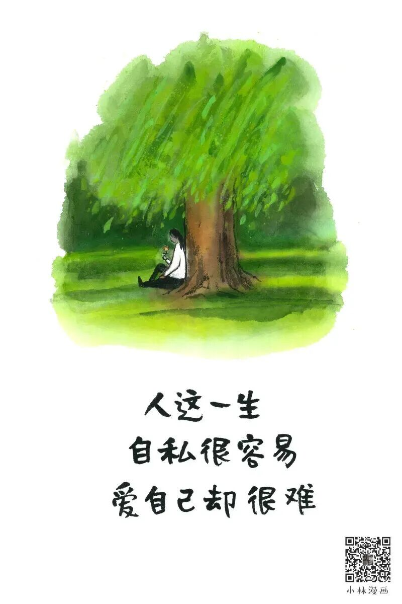
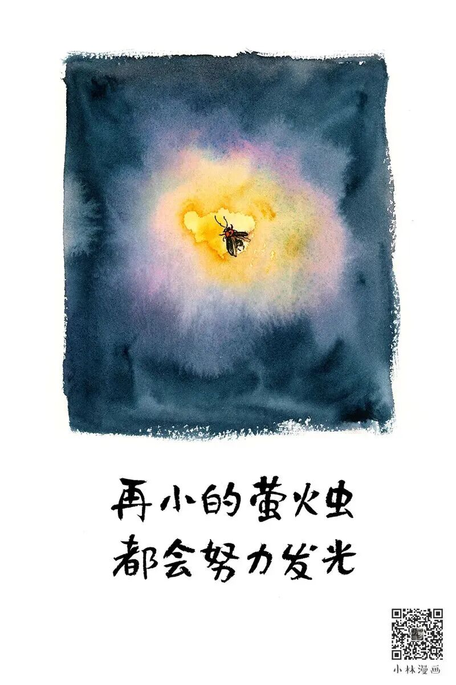

# 小林漫画：顺从自己，取悦自己，置顶自己

- 原文链接：<https://mp.weixin.qq.com/s/9Vz10oHcsqUqfkBh-ridOg>
- 归档时间：`2026-08-28T17:36:20.888612+08:00`
- 归档范围：已清理署名、二维码、广告、推广和无关装饰后的原文正文。

## 原文正文

1

爱自己

是终身浪漫的开始先做自己

再拥抱世界

原始图片链接：<https://mmbiz.qpic.cn/mmbiz_jpg/UCVnfYLyn8Wr0PxkRFouqb8PRvL4s6sL8iaM5CibJ9psqkulbLnxibmDvhOxt9stibInaIibiasoklEmTyOp50NUYsqWn7ImoCGIvT0BvfBHsCS0E/640?wx_fmt=jpeg>

2

我们总被外界的声音左右

可人生没有固定模板

也没有必须要做的事

如果有一件事必须要做

那就是要好好爱自己

去尊重全世界

但只听从自己

永远置顶自己的感受

原始图片链接：<https://mmbiz.qpic.cn/sz_mmbiz_jpg/UCVnfYLyn8V0rgckWExxwgU7y0caITibbR2o9CdEI1Tb7t6Ywfg39wmYvS00iafETjmtXeP0rTsekOwnDL4Rr0bvXiagMxn8xTialCY8fUlCooQ/640?wx_fmt=jpeg>

3

不必羡慕他人的成功来得太早

也无需为自己的暂时落后而焦虑

每个人都有自己的成长时区

找到自己舒服的节奏

按照自己的步伐

耐心积累

稳步前行

原始图片链接：<https://mmbiz.qpic.cn/mmbiz_jpg/UCVnfYLyn8WAm8vhMxtemEY9DoUfggk8ibneCgicppBfhO4kpMfszJXs6TRO0UicwrlwjIzdBT47QQllQNg2GQibGHH2Glib3icra8UnVx7UrDPYE/640?wx_fmt=jpeg>

4

真正的丰盈

源于内心的播种

在心里种花

人生才不会荒芜

花会沿路盛开

你以后的路也是

原始图片链接：<https://mmbiz.qpic.cn/mmbiz_jpg/UCVnfYLyn8Xq3eY1my4k2zZVI6iaKF2C2sSliaFLMK4RzHwr01BZN8Cu7wGk03q7Kl69yNILoURdfC50OINaPyicaLAVK06GJqQGCftGjXeJSA/640?wx_fmt=jpeg>
