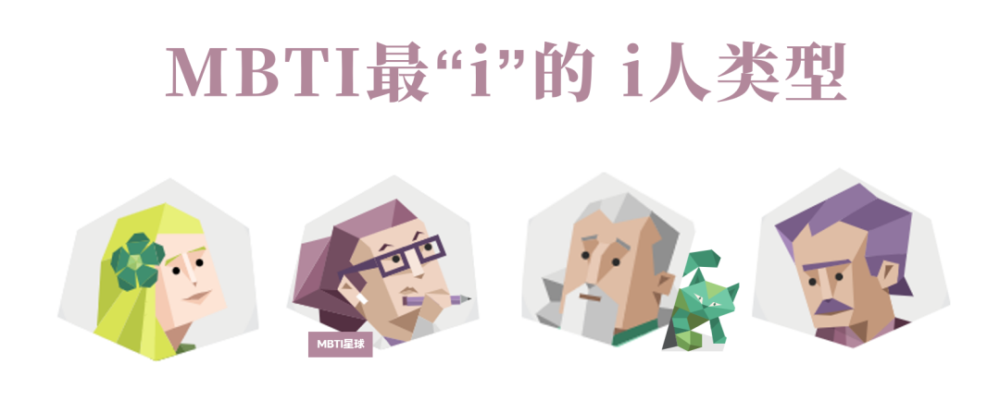
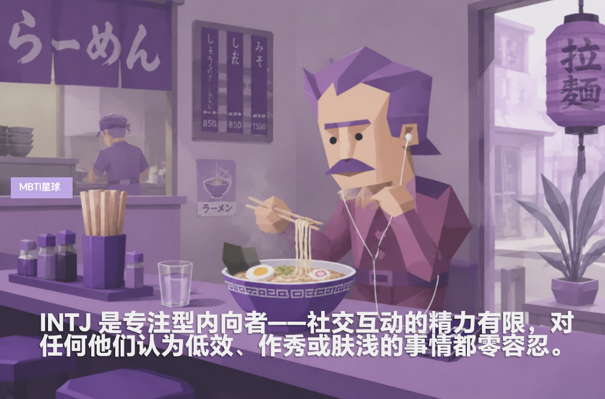
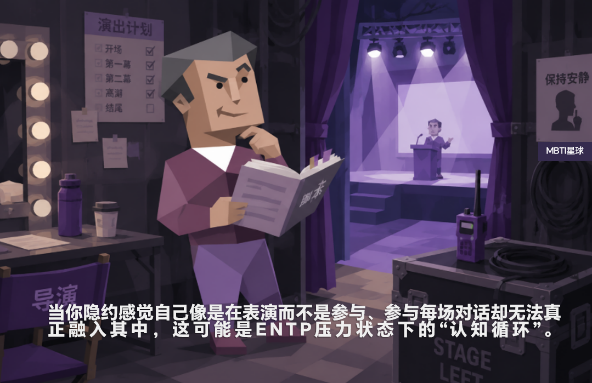
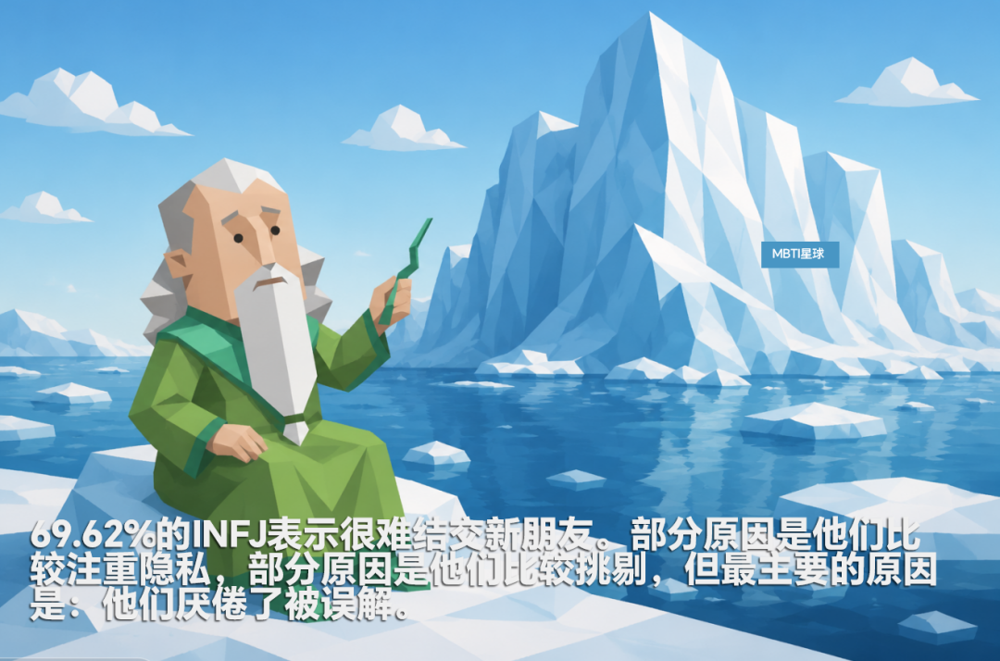

# MBTI中最“i”的“i人”是哪个？

- 原文链接：<https://mp.weixin.qq.com/s/DceTyYNA6zd1B65FClc1DA>
- 归档时间：`2026-09-03T11:22:20.048914+08:00`
- 归档范围：已清理署名、二维码、广告、推广和无关装饰后的原文正文。

## 原文正文

原始图片链接：<https://mmbiz.qpic.cn/sz_mmbiz_png/JZlXeF8Z1ot7ZicI5KXM2cHqF2ibL1KOI1c8qA3frTwLXibPYV3XtjzGaGribYENmUTqypwMCRDq4aANNUS6R86UdoZRaSmEeObpT9yhmmpZox8/640?wx_fmt=png&from=appmsg>

你觉得自己能容易和他人产生联系吗？

有的人享受独处，是因为外部世界的刺激不如内心世界的吸引。

同样是内向型人格，哪些性格可能更满足于独处状态呢？

MBTI的内向程度排名

当被问到“你感觉与他人没有强烈的联系”时，最可能认同的类型：

第1名：77.46%的 INTP（逻辑学家）

第2名：75.06%的 INTJ（建筑师）

第3名：75.05%的 ISTP（鉴赏家）

第4名：72.34%的 ISTJ（物流师）

第5名：50.39%的 ENTP（辩论家）

第6名：48.77%的 INFP（调停者）

第7名：47.00%的 ISFP（探险家）

第8名：44.17%的 INFJ（提倡者）

总体而言，内向思考型人格（I_T）比外向情感型人格（E_F）更可能认为自己缺乏和他人的强烈联系感。

而有趣的是，“ENTP”（辩论家）型人格是唯一入围内向排名的外向型人格。以下我们根据“内向”程度来分析不同人格类型排名：

1.逻辑学家（INTP）：图书馆的幽灵

根据16型人格官网数据，高达77.46%的 INTP 表示自己感觉和他人缺乏强烈的连接，位列十六种人格类型第一名。

友谊对他们来说就像一个难以预测的系统，充满了太多的社交变数——义务、闲聊、情感维系、时间安排等等。

INTP就像进入“纳尼亚世界”一样，从聚会或群聊中消失，沉浸在自己的思绪中好几天都忘了出来。

当他们再次出现时，通常会带着一个半成品的发明、一个奇怪的哲学问题，以及一个他们忘记自己还拿着的三明治。

原始图片链接：<https://mmbiz.qpic.cn/mmbiz_png/JZlXeF8Z1osZnkib7uYFVseiahviaDWG3VJxpOHp7zEWlB19EsnnszWdt9Cq5p7ialicamNyEhmYyKKgWh7ET1yia7KLRWiaxThgPLuYZaDeAA15G4/640?wx_fmt=png&from=appmsg>

INTP的内向思考（Ti）往往代表拨开迷雾，找出真正有意义的东西，它并不迎合情感，而是研究经得起逻辑推敲的东西。

外部生活对他们来说常常是一种干扰——一个低信号、高噪音的环境。

总的来说，INTP天生就喜欢内省。这并非因为他们不喜欢人（虽然有些INTP确实如此），而是因为他们的大脑已经占据了全部精力。

他们往往拥有低调、小型的社交圈，朋友也比较“独特”。

一位INTP分享：“我想要的是像秘密科研联盟一样的友谊。”

2.建筑师（INTJ）：独处的战略家

INTJ的“内向”并非指“害羞内向”，而是指“我的内心世界，远比大多数外部刺激更具吸引力”。

他们关注内在模式、长远愿景以及源自内心深处、难以言喻的直觉洞察，在符合愿景的情况下做出高效的决策并采取行动（Te）。

因此，INTJ看起来拥有比许多“i人”更直接、更自信的语气。他们在会议上积极发言，勇于担当。

但不要被表象所迷惑——他们宁愿回家阅读十篇关于地缘政治变化的文章来充电，也不愿花一晚上时间和别人聊新饮食习惯。

原始图片链接：<https://mmbiz.qpic.cn/mmbiz_png/JZlXeF8Z1otVpCS3lAcLUEACCxGTWNmdQP5E71nYJpQEPOTTib30L7J24bpRSL4lbTPoy19510mwquGUJoEh2g61oicRdOYJicQEXD6koIku4M/640?wx_fmt=png&from=appmsg>

他们有意为之地保持一个小型而有意义的社交圈，在那里，他们的真实想法和观点能够得到接纳，而不是被压制。

当INTJ投入一段友谊时，是因为这段友谊对他们来说意义非凡。

你已经通过了重重考验，他们分析、考察过你，最终认定你值得他们投入最宝贵的资源、时间。

INTJ 是专注型内向者——社交互动的精力有限，对任何他们认为低效、作秀或肤浅的事情都零容忍。

3.鉴赏家（ISTP）：默默行动的独行侠

ISTP型人格的人会消失六个月，徒步穿越阿巴拉契亚山径，亲手打造一艘独木舟，然后回来时既不证明什么，也不谈论这件事。

他们是真正意义上的内向者——“请不要在我思考的时候和我说话”基本上就是他们的人生格言。

原始图片链接：<https://mmbiz.qpic.cn/mmbiz_png/JZlXeF8Z1ovRE48IYWGWlawgflUYNCCDbZIErGquiccNBXtC4Pmibm4zb6NFcOo63icic5bhkluRldwTCtc1ReoASKmMKUmScuU1PKOPY6NGst0/640?wx_fmt=png&from=appmsg>

内向思考功能为他们构建了一套强大的内在逻辑、精准和独立性过滤机制。

他们不需要把事情说清楚，他们需要的是空间，是探索的空间，是按照自己的方式来解决问题的空间。

再加上辅助功能外向感觉（Se）造就了他们脚踏实地，专注于当下，但更倾向于与事物和环境互动，而非与人交往。

ISTP往往情感内敛，不容易信任他人，并且对那些令人感到疲惫或不真诚的社交要求保持警惕。

3.物流师（ISTJ）：忠实的完美主义者

ISTJ型人格是典型的“内敛型”人格。除非有实际用处，否则他们不会开口。

内向感觉（Si）为是一种细致入微、基于记忆的过程，能够察觉哪些可靠，哪些不可靠，以及上次出了什么问题。

他们默默地维持着世界的运转，保持稳定可靠的行动，然后在别人还没来得及感谢他们之前悄然离去。

原始图片链接：<https://mmbiz.qpic.cn/mmbiz_png/JZlXeF8Z1os8SGiaubNc4UzicLAUJRxOaDP6icwNOaKCumwDJiaaJN6EiavLfbqYljPVLsNRuNkejyB1gPvYiaicrQgIMs5DgrOXX1ibXcliaJLo3iaCQ/640?wx_fmt=png&from=appmsg>

结交新朋友？这可能是一项挑战。88.24 %的ISTJ表示这并非易事，这一比例在所有人格类型中最高。

许多ISTJ感到被忽视、被误解或被低估——他们性格内向，忠诚往往被视为理所当然，严肃认真常被误解为冷漠。

如果他们感到被冷落，他们会把这种情绪藏在心里，暂时搁置，然后去做自己的事。

4.辩论家（ENTP）：e人中最像“i”的类型

ENTP可以随时随地与任何人畅谈任何事，但却总感觉没有人真正了解自己。

他们的大脑就像一台爆米花机，源源不断地涌现出各种想法。一个想法会引出另一个，然后又一个，在你眨眼之前，十二个想法就涌现出来。

与之相辅相成的是内向思考（Ti），它默默地在幕后分析和完善一切。

原始图片链接：<https://mmbiz.qpic.cn/mmbiz_png/JZlXeF8Z1oumVt14kFWjUQq8zCPfMExxTJbjTKPUNJ1Mia7xnWLHCPv9erTyibcAVPqP2ZxL90L7iauzyZuLlrq2jgibk5nFBG2cbkZtFcaNbKE/640?wx_fmt=png&from=appmsg>

这种组合造就了聪明、好奇、率真，但在所有谈吐的背后，却又略带一丝疏离感的人格。

5.调停者（INFP）：灵魂探索师

INFP 的内向就像一封隐秘信——封闭、私密，充满了可能要到第五页才会大声说出来的话。

他们不仅拥有深刻的个人内在价值体系（Fi），同时有着如同狂风中的落叶般抛洒着各种想法（Ne）。

这种组合造就了一个主要生活在意义（meaning）领域的性格：

一个渴望生命有意义的人，一个既能在悲剧中发现美，也能在一切美好事物中窥见悲剧的人。

原始图片链接：<https://mmbiz.qpic.cn/sz_mmbiz_png/JZlXeF8Z1ouC1gG0AygXub39bTsMJicE9r7VZzHSTbbPciaicdVotVQnADqQZEEZdcOAhqJ8wEBVOsgRggjh2LoNo3WhIeic3IAL6VXXv3tcgu8/640?wx_fmt=png&from=appmsg>

一个比起身处现实，更常沉浸在对未来的想象中的人。

这就是INFP的悖论：内心有深沉的爱，却难以建立深层的联结。

拥有丰富的内心世界，却常常感到被困其中，独自彷徨。

6.探险家（ISFP）：温柔型反叛者

外向感觉（Se）功能让 ISFP 能够感知周围世界的美、质感和触感。

他们对周围环境非常敏感，但并不总是想与之互动。有时，他们只想置身其中，独自一人，最好是被树木环绕。

他们建立关系比较慢，追求的是深度、真诚和情感上的自由，而不是频繁的互动、过度粘人的“依赖”。

7.提倡者（INFJ）：社交型内向者

INFJ 经常被称为“社交型内向者（social introverts）”，但这并不是因为他们喜欢社交——而是因为他们无法抑制内心的关心。

他们敏锐的洞察力（Ni）、识别他人情绪和需求（Fe）结合起来，你能看见一个温暖、健谈、善于交流的内向者。

而实际上……他们其实已经精疲力竭，而且可能已经好久没有感受到自己被真正理解。

原始图片链接：<https://mmbiz.qpic.cn/sz_mmbiz_png/JZlXeF8Z1otT8HmicD8uia7c7vYGVyZWrCGB91Z5cwQHz8BtXF00j0KqjUczPPoZibvY38icFZHZx3WRfLicGicENtx5UtfIw7Xmaoica4rribmdicNw/640?wx_fmt=png&from=appmsg>

69.62%的INFJ表示很难结交新朋友。部分原因是他们比较注重隐私，部分原因是他们比较挑剔，但最主要的原因是：他们厌倦了被误解。

INFJ 就像冰山：90%的想法、痛苦和才华都隐藏在水面之下。

原始图片链接：<https://mmbiz.qpic.cn/mmbiz_png/JZlXeF8Z1ov56YrLmDcTtRSdmbicLcMgQO8LbEKFZepQXW0evXth4sB2lAtibnpcVw3Bia0QR5f2zNQKC3F0mzuaicB0lyK3EFFYUibHX1Sd6Iq4/640?wx_fmt=png&from=appmsg>
