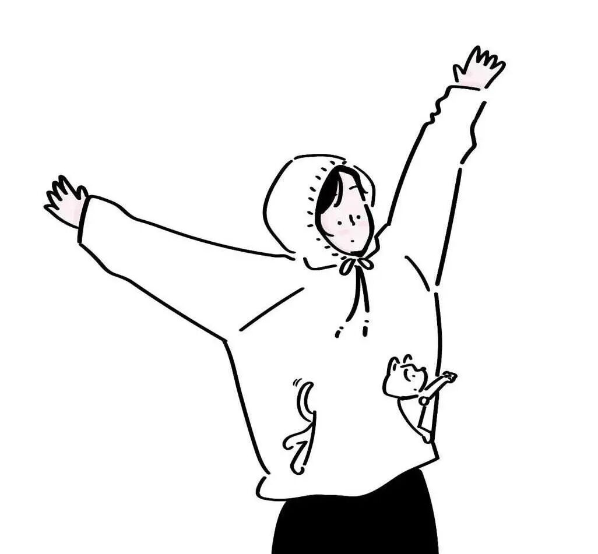
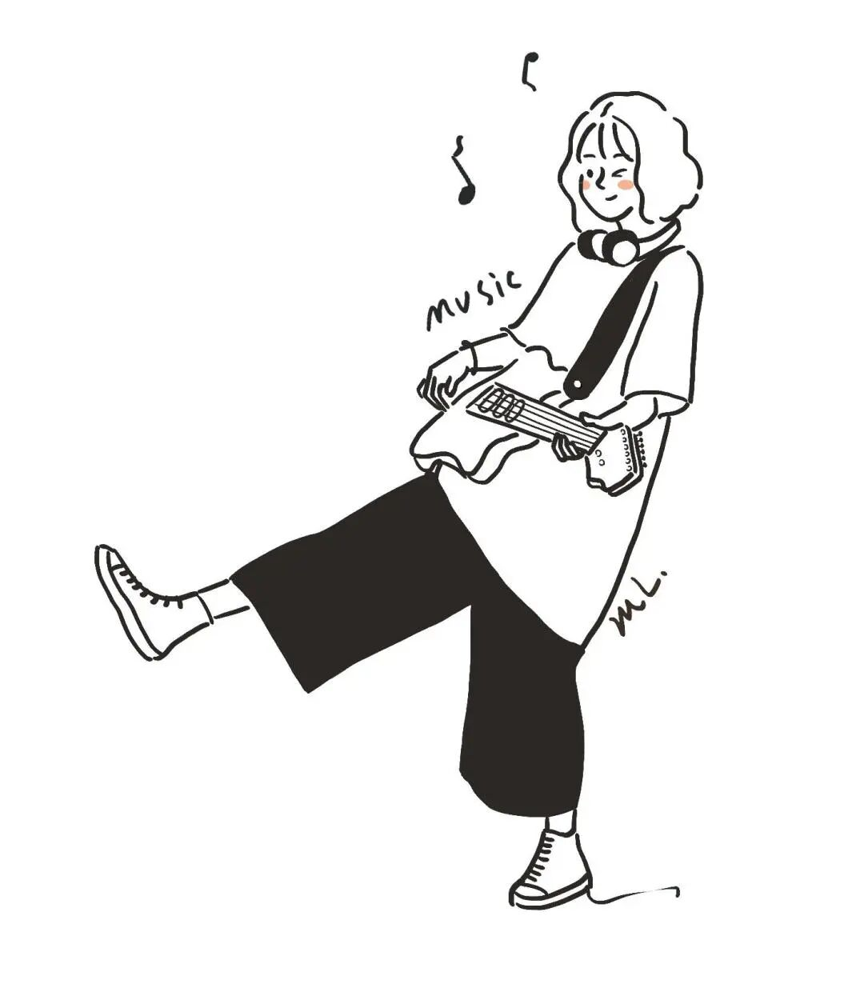
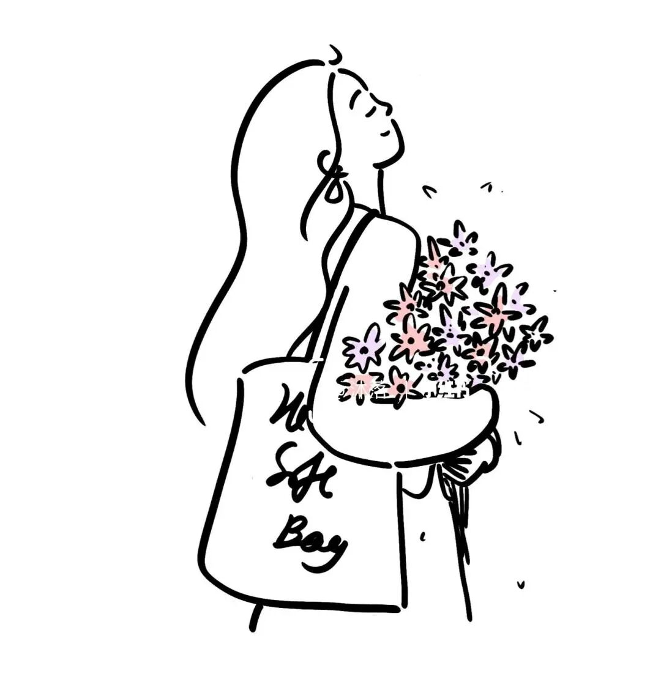

# 请远离消耗你，会激发你的恶的人

- 原文链接：<https://mp.weixin.qq.com/s/_47HHhXDSqezaPmklUYMug>
- 归档时间：`2026-09-03T10:56:28.806700+08:00`
- 归档范围：已清理署名、二维码、广告、推广和无关装饰后的原文正文。

## 原文正文

1

圈子真的能决定状态

很多时候你变得焦虑 易怒

戾气很重

不是你本性变差了

而是身边的人不对

有一种人最耗人

他们负能量缠身

会吸走你的耐心和好脾气

把原本平和的你

变得面目全非

原始图片链接：<https://mmbiz.qpic.cn/mmbiz_jpg/UCVnfYLyn8VHibQkib6HKrLicqBZKmibokPGfe4cibia6IMh1za9XrcjhwiaqzyYSUytLUJyey4R0XibkpSCaBW6jpdI1MfIGgoOGmmqUvoQs1yYJEg/640?wx_fmt=jpeg>

2

相处舒服的人

会包容你的缺点

抚平你的情绪

但消耗你的人

专挑你的软肋刺激你

试探你 逼你发火

在他们无休止的纠缠算计里

你会忍不住计较 争吵 怨恨

长成自己最讨厌的模样

原始图片链接：<https://mmbiz.qpic.cn/mmbiz_jpg/UCVnfYLyn8VliaCQMLUpJOGO9EArFlw65y2eWhzXa5d6wSob0ItiaEPf5cYsyYRMqwsOsr5wnIbES0KARvnTnXKnQIH7xlUzR84QTsEa8Yk8M/640?wx_fmt=jpeg>

3

他们会激发你骨子里的恶

原本你待人真诚

懂得换位思考

可遇上爱算计爱挑事的人

你不得不学着防备

学着计较 学着冷漠

你开始争辩 反击 寸步不让

你所有的尖锐 戾气 坏脾气

都是被烂人烂事逼出来的

原始图片链接：<https://mmbiz.qpic.cn/sz_mmbiz_jpg/UCVnfYLyn8VfBDZtXI6WfpJzXK5QXQGBY60nMMCFoicDUd2VelURrDFRuPZ86ZL2Fc39pp88O6iceqSKrwicjPpCmEAzclCibmxhsibL0wXSs5M0/640?wx_fmt=jpeg>

4

要学会筛选身边的人

不必和所有人磨合

不必勉强自己合群

遇到不断消耗你

拉低你认知 逼你失控

激发你恶意的人

一定要及时止损果断远离
