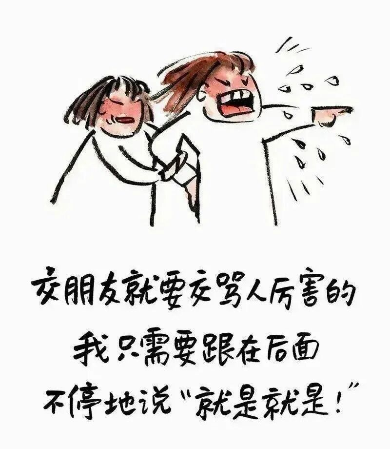
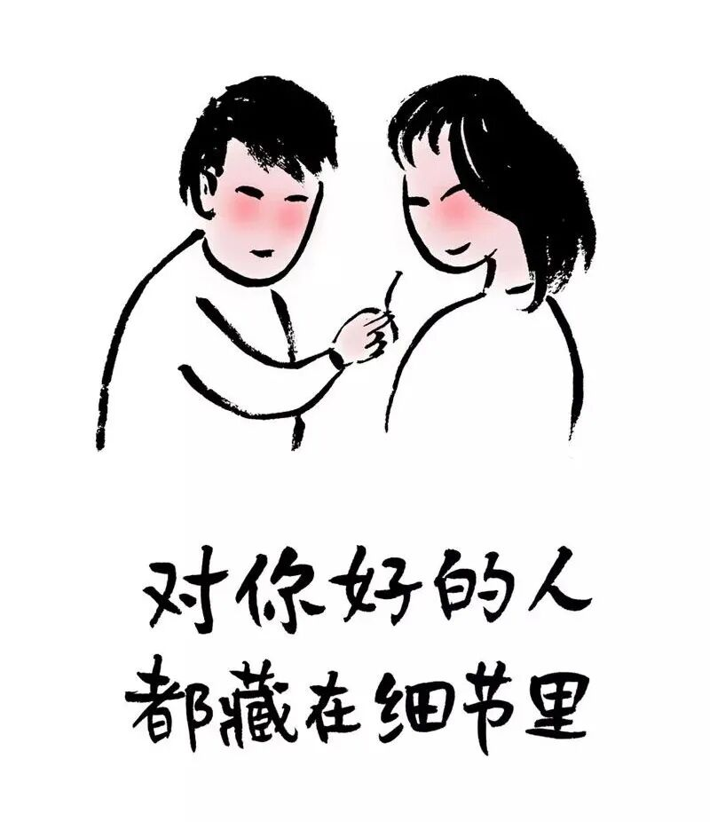
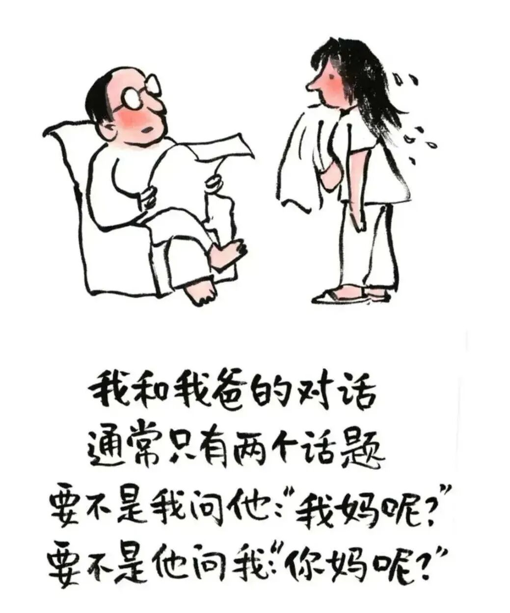

# 小林漫画丨最好的关系是:相互麻烦，彼此感恩

- 原文链接：<https://mp.weixin.qq.com/s/hL1Fhg83QePRdGZ9pG-2gQ>
- 归档时间：`2026-09-03T18:28:41.661566+08:00`
- 归档范围：已清理署名、二维码、广告、推广和无关装饰后的原文正文。

## 原文正文

朋友：一个敢开口，一个没嫌烦

你出差，猫没人管，一个电话甩给闺蜜：“来我家当几天铲屎官。”她骂你“把我当保姆”，第二天却发来照片：猫躺她腿上，她一脸享受。你回来带特产，她拎着猫粮说“下不为例”，下次你还没开口，她先问“猫粮放哪”。

她搬家，你嘴上说“不想动”，身体很诚实地去了，扛箱子上五楼，累得说“这辈子最后一次”。下次你搬家，她比你到得还早，还带了个折叠推车，说“上次累怕了，这次有备而来”。

你失业没钱，她二话不说转你五千，备注“别急着还，利息按年化百分之十算”。你找到工作，第一笔工资请她吃火锅，她点了一桌，剩一半说“打包给你，省得做晚饭”。你们之间，钱算得清，情算不清。

最好的朋友，就是互相欠着人情，欠着欠着，就欠了一辈子。谁也不急着还，因为知道——下次还有机会。

原始图片链接：<https://mmbiz.qpic.cn/mmbiz_jpg/UVsZ2xn51XJzickw2PZYibMPFpHArqKgEf9p0TjtHe0DvgHVdaJq67icxKzaQcXO5Otsqiaggtzia9anzj10LrG9JA5WwqENKUtnIa6G28YHFibTA/640?wx_fmt=jpeg>

02

恋人：嘴上烦，手上没停

你加班到凌晨，发消息说“饿了”，他回“活该，谁让你不点外卖”。半小时后，他拎着馄饨出现在公司楼下，汤洒了半袋，说“将就吃”。你吃了一口，他说“慢点，又没人抢”。

他打游戏输了，脸臭得像欠他五百万。你懒得哄，去厨房煮了碗面，搁他面前。他边吃边骂队友，你边听边刷手机。他吃完说“再来一碗”，你翻白眼，还是去了。

你试衣服问他“显胖吗”，他头都没抬说“显”，你生气，他补一句“显胖我也喜欢”。你说“滚”，他说“那你先去把地拖了”。你拖地，他洗碗，谁也不谢，但碗池里那口锅，他刷了三遍。

最好的恋人，不是不麻烦对方，是麻烦得心安理得。你帮我倒杯水，我帮你捏捏肩，谁也不谢，但都记在心里。

原始图片链接：<https://mmbiz.qpic.cn/mmbiz_jpg/UVsZ2xn51XKGiclAxibIksfyjQAWibJ0bu5yNyoiaE1zGonYibNMJ7vSMPWzygyLA54cynKQPfTylKCibu3lOYx17xbd2hLLgrZbFpe6o7VL2vCuc/640?wx_fmt=jpeg>

03

亲人：互相嫌弃，从不记账

你妈来你家住，嫌你懒，嫌你老公不干家务，嫌孩子不听话。你被她念叨烦了，顶嘴“那您别来了”。第二天她一早去买菜，做了你爱吃的糖醋排骨，说“多吃点，瘦得跟猴似的”。

你爸手机又卡了，打电话给你，你说“重启”。他说“重启了还是卡”，你说“那换个新的”。他说“没钱”，你转了三千，他收了，回一句“算我借的”。过年你回家，他塞给你一个红包，说“压岁钱”，你打开一看，三千。

你弟借钱买房，你借了五万，说“三年内还清”。他第二年就还了，多还了两千，说“利息”。你没收，他硬塞给你妈，你妈转手给了你孩子当压岁钱。你们姐弟俩，账算不清，但谁也没真计较。

最好的亲人，就是互相嫌弃，又互相惦记。你欠我的，不用还；我欠你的，你忘了。谁也没想着还完，因为欠着欠着，就一起走过了一辈子。

原始图片链接：<https://mmbiz.qpic.cn/sz_mmbiz_jpg/UVsZ2xn51XIPX0WhW9JOFXPdskXBb2X2ruNrR6DcB5ZIOIAiciaCWTdUfFy5EMSg9f1DjArEqnuBYNCGwnHvhL5XsVbK65bv67RPfYzAibLce4/640?wx_fmt=jpeg>
