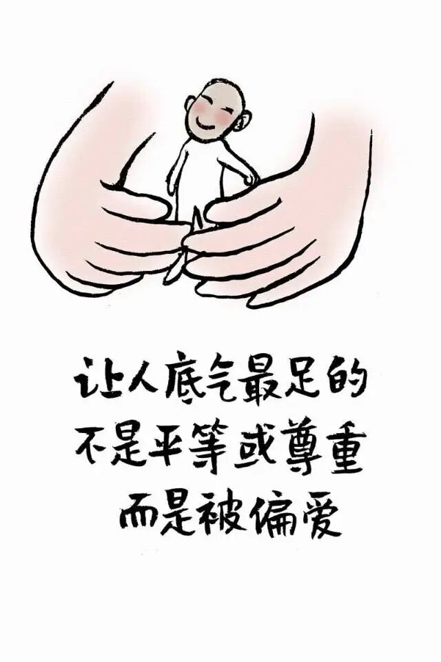
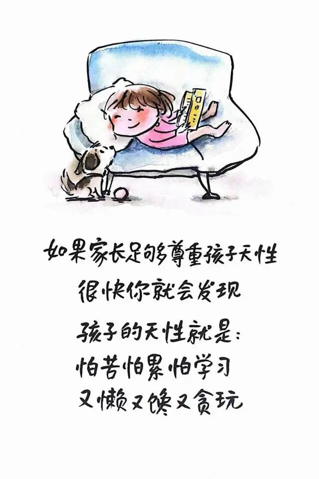
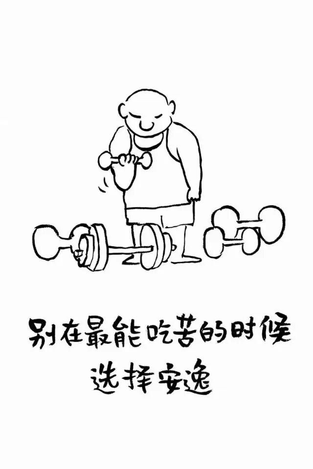
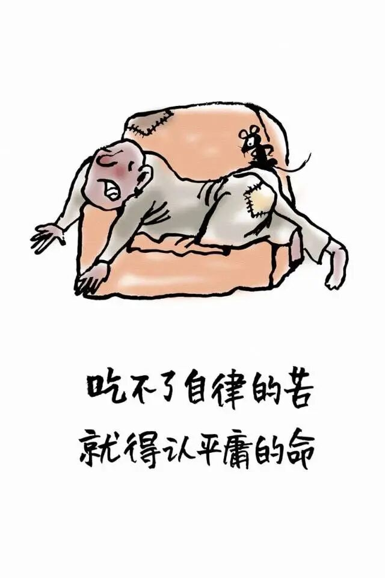

# 小林漫画：不想把孩子养得自私又叛逆，就不要“过度尊重”孩子

- 原文链接：<https://mp.weixin.qq.com/s/k5urt_RYlvuJK9WM3POxaw>
- 归档时间：`2026-09-03T11:37:34.753192+08:00`
- 归档范围：已清理署名、二维码、广告、推广和无关装饰后的原文正文。

## 原文正文

01

不少父母信奉开明育儿

凡事商量 充分倾听

尽可能给到孩子充分的选择权

本以为这样养出的孩子
懂事 独立 有主见

可步入青春期

矛盾接踵而来

写作业拖延 提醒一句

换来 “你不尊重我” 的反驳

约定好的事 转身就不认

诉求没被满足 就哭闹发脾气
好好商量 换来得寸进尺
强硬管教 说父母控制欲太强

到最后才明白
一味顺从从来不是尊重
是没有边界的纵容

原始图片链接：<https://mmbiz.qpic.cn/sz_mmbiz_jpg/bCLNBTjZYsbcfvLDpus6TiclEtBtQrvOiaNFp9icnAEhiclVNdMa2FoOka3OrL3ZXems6HaIk6UkUIQMMfJsQEU61Hday2ficfNqNLT901kpiaITM/640?wx_fmt=jpeg>

02

真正的尊重
是看见孩子的感受
不是满足他所有的要求

事事退让 不断妥协
看似给了他尊重
实则给了他错误的信号：

所有人都应该顺着我
只要我不开心 别人就得让步

于是他没有规则意识
不断试探父母的底线
一旦现实不如意
抵触 冷战 对抗就来了

父母一次次退让
放弃本该坚守的原则
看似在保护他
实则剥夺了他

学习承担后果的机会

尊重不等于全部顺从
自由永远需要边界

每一次没有边界的退让
都在教孩子一件事
规则是可以被情绪推倒的

原始图片链接：<https://mmbiz.qpic.cn/sz_mmbiz_jpg/bCLNBTjZYsY9JYvCcIQG0C3ycXobLictfGWUIx7aq87Uk2beV8umoUlC5dsn7AWN7ozwnjaQea1lib3cdRiaZe76qVWbLu4Foic8aibCWSLibc4hc/640?wx_fmt=jpeg>

03

尊重要有尺度
爱更要有规矩

孩子可以决定

自己的喜好和节奏
这部分 给他空间

但关乎品行和责任的事
不能由他随心所欲

出勤 习惯 是非对错
属于父母该把好的关
他再抗拒

也不能全依着他

教会他一个道理：
有些事你可以选
有些责任 你必须担

同时 父母也要守住底线
不被“你不尊重我”这句话绑架

该拒绝就拒绝
该执行就执行
让他体会到

行为带来的后果

坚守底线不是不爱他
是教会他
世界不会永远顺着他
人要为自己的选择负责

原始图片链接：<https://mmbiz.qpic.cn/sz_mmbiz_jpg/bCLNBTjZYsYbmuqLLrGNJVjXtHdekUBicl73dOSZs8mPD9Nm1a4pvHquGvicPtpgpkC9SgHuaZXrpWmO0ID2mjznnFib44RRQbefqGmGqUgrnY/640?wx_fmt=jpeg>

04

最好的尊重
是接纳情绪 但不纵容行为

孩子会烦躁 会叛逆
会有失控的时候

情绪本身没有对错
可以倾听 可以允许他宣泄

但倾听不意味着妥协
接纳不代表着退让

当情绪被看见了
边界也被守住了
他才会慢慢明白

我的感受很重要
但我的要求

不会被全部满足

尊重是底色
规则是框架

在界限之内给理解
在原则之上守立场

孩子才能长出自律
学会分寸
懂得体谅他人

原始图片链接：<https://mmbiz.qpic.cn/mmbiz_jpg/bCLNBTjZYsaZW8b3DWiarNsGovfsaDaLQ20SSMAIJryfRgtdoT6ibbX4u2tSdsGW4icSFNMSFN08pB2sRibP8qibLYlrkmrYjyrFLCxUBrlcZGf4/640?wx_fmt=jpeg>
