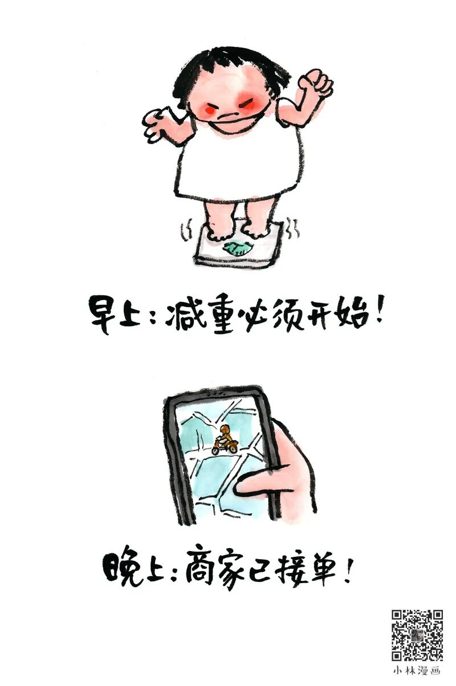
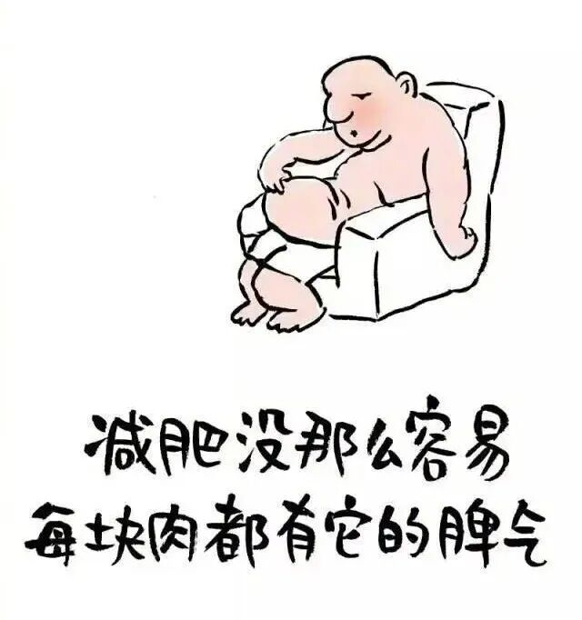
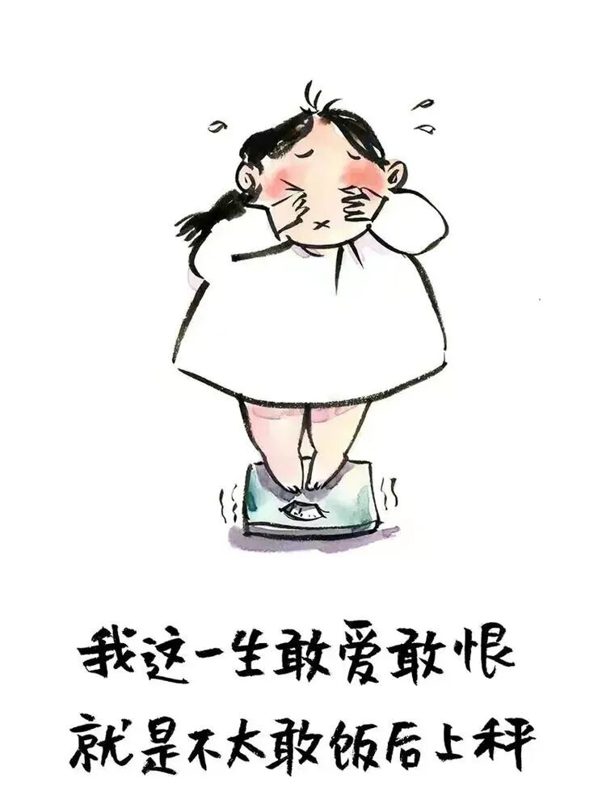

# 小林漫画：中年少女的减肥观

- 原文链接：<https://mp.weixin.qq.com/s/znqdj1VXCKOcAVVJxiN-ZA>
- 归档时间：`2026-09-05T13:47:15.504249+08:00`
- 归档范围：已清理署名、二维码、广告、推广和无关装饰后的原文正文。

## 原文正文

01

你是不是也说过很多次

“明天开始减肥”

晚上立flag

第二天照样点外卖

看见体重秤

心跳都加速

但看到好吃的

又觉得人生不能太苦

一边焦虑身材

一边又舍不得那点快乐

减肥这件事

好像永远卡在“开始之前”

原始图片链接：<https://mmbiz.qpic.cn/mmbiz_png/UVsZ2xn51XIajPcVFnVOUdbEd3wEPvJ91JIKScPvuMsVGI6kAib70bp1Lw0ysA2EibQjiaGZFTyQERWfZzwYBIibnvEBWspFgCkVIVX4DGichiawY/640?wx_fmt=png&from=appmsg>

02

你试过很多方法
断碳水

节食

疯狂运动

一开始很狠

后来很累

坚持几天

就开始怀疑人生

不是你不自律

是你急于求成

对自己过度用力

把减肥当成一场硬仗

结果越打越疲惫

原始图片链接：<https://mmbiz.qpic.cn/sz_mmbiz_jpg/UVsZ2xn51XJEMJaHwRt7qibmK5TjIicRzTibNdSRWUVU6Cco4zHvamBiaBs18TCKTQ5icibqvbdmKicNQIlbtmV0IUN1ULoiaMQNeTic11oialdlb7SJM/640?wx_fmt=jpeg>

03

后来你慢慢明白

减肥不是与身体对抗

是学会跟它合作

吃得健康一点

动得轻松一点

不用极端

也不用焦虑

慢一点

但能坚持得久一点

变好这件事

从来不是一夜之间

是你开始认真对待自己之后

一点一点发生的改变

原始图片链接：<https://mmbiz.qpic.cn/sz_mmbiz_jpg/UVsZ2xn51XKr9sIth0iaBQNlPLVic9OPvNicPibZF03FucRlPDicQzpwvuUnVxzcEJSUQV8J1vqwk6YM2BEXvgZ9nq3DJic9nDbqFJiccGCmOA2icb0/640?wx_fmt=jpeg>
