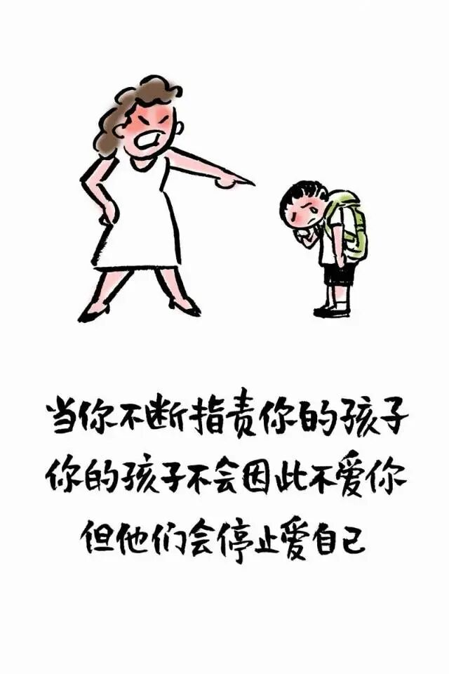
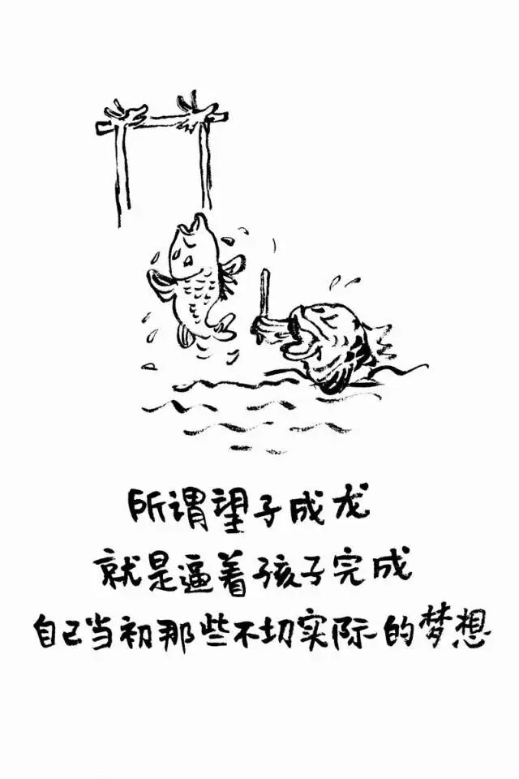
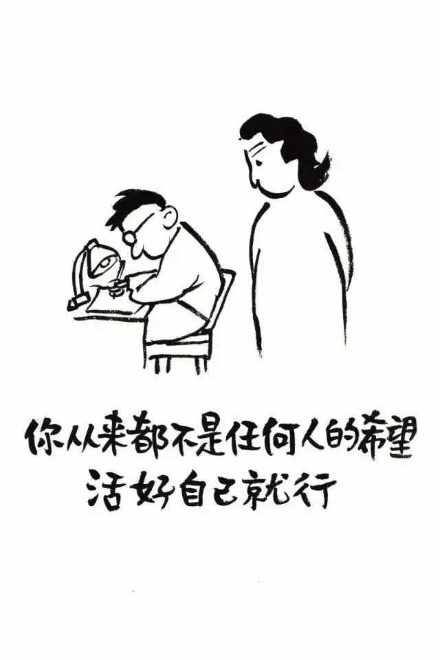

# 小林漫画：永远不要献祭自己的孩子

- 原文链接：<https://mp.weixin.qq.com/s/MN4ldpuKjSRgoh8f2EaQ5w>
- 归档时间：`2026-09-05T13:12:39.710632+08:00`
- 归档范围：已清理署名、二维码、广告、推广和无关装饰后的原文正文。

## 原文正文

大人社交时
常不经意间拿孩子做话题
当着众人的面细数他的不足
拿别家孩子的长处

比自家孩子的短处

于大人而言
不过是自谦式的客套
几句随口而出的玩笑

可落在孩子耳中
是一场当众的否定与揭短

孩童的自尊
薄得像一层纸
一次次被人情世故的利刃划破
便再也拼不完整

原始图片链接：<https://mmbiz.qpic.cn/mmbiz_jpg/bCLNBTjZYsaX29F4dgekrtfF604ZZ5EHv0tcZeNNWV8SMs1LricVfxjvHLzsS3mpeN8TeKTwCpcFs3kfxXCntpjzPZDv2HNs4UPak6J3MBFU/640?wx_fmt=jpeg>

每一句对外人诉说的缺点
都是一颗悄悄埋下的种子

它种在旁人的印象里
也种在孩子的心底
更种在父母自己的心中

孩子对自我的认知
最初都是从父母的评价里长出来的

听久了负面的声音
便会在心底生出回响：
“我大概就是这样差劲的人了吧。”

原始图片链接：<https://mmbiz.qpic.cn/mmbiz_jpg/bCLNBTjZYsb05o5BxIDPZQaWv2NlrtwcMpFicWUljdyD0SXarJzwp1FgaQ24ag1m0I35I2XmlS4ibYFfCzO9MiblVa0qf8swANBsNJ70VLicTVc/640?wx_fmt=jpeg>

成长这件事
适合安静沉淀

分数 挫败 软肋
是孩子心里最柔软的地方
不必摊开来供人围观

逢人少谈孩子的境遇
不炫耀 不揭短 不诉苦
便是给了孩子一个

不被指点的童年

原始图片链接：<https://mmbiz.qpic.cn/sz_mmbiz_jpg/bCLNBTjZYsa76uTq3GK1YwBLGOYrcFAp5iboszxBliamNI0ibqHIaIoA6apH3b8zoqdWDycIuKiciaic2DJwibgKGjupq8RO1ghbKZGaM2jAmGZbK0/640?wx_fmt=jpeg>

真正到位的养育
是看见孩子原本的样子
而不是要他活成预设的模板

多看闪光之处 少做否定之语
多给期许之光 少下判决之词

爱是如他所是
而非如你所愿

言语自带塑造力量

不去消耗孩子自尊

才能托住他内心成长的底气

原始图片链接：<https://mmbiz.qpic.cn/sz_mmbiz_jpg/bCLNBTjZYsbpQJS9rbzXZfQNRiaPRibl3PoYnJbj4icYDSOma2gPcibhvhZNcRJmmaxYiaD52ib1Fk4K4TQMCI6UkPhabOkiaZdMuibk5ibc3rLC12gk/640?wx_fmt=jpeg>
