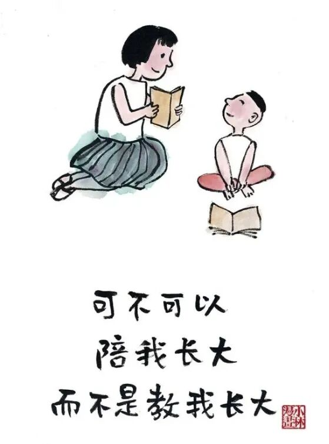

# 辅导作业：一场没有赢家的亲子搏斗

- 原文链接：<https://mp.weixin.qq.com/s/QkTg-rKjesxITFj7v6tdWw>
- 归档时间：`2026-09-05T13:39:13.436183+08:00`
- 归档范围：已清理署名、二维码、广告、推广和无关装饰后的原文正文。

## 原文正文

01

摊开作业本，母子关系瞬间跌停。

一道减法题我讲了三种解法，他选了第四种——抠橡皮。

“听懂了吗？”他点头如捣蒜。写出来的却是，3+5=9。我突然理解了我妈当年的高血压。

我开始怀疑自己当年是怎么毕业的，更怀疑遗传学是不是骗人的。吼了一嗓子，他眼圈红了，我心里那把火灭了，换成了内疚。用手机搜答案，假装是“启发思路”，其实我也不会。

终于明白，知识不会通过声带传播，但高血压会。

原始图片链接：<https://mmbiz.qpic.cn/mmbiz_jpg/UVsZ2xn51XKIugmIZRJKk8lHvvzZSWoBknCCVkTpbq4JaPvhK93x0p9JJibveAVYsKBOddiaprGgIBnvdO6QaatDc3HzYfZZZQ9bOFgItOAqo/640?wx_fmt=jpeg>

02

喉咙里的分贝，压下去是乳腺增生，吼出来是邻里报警。

他抽泣着说“妈妈你以前挺温柔的”，我愣住了——那是因为以前你只负责喝奶和睡觉。

作业本上的红叉，像一面面小旗，插在我日渐崩塌的耐心高地上。数学能等，语文能等，辅导班也能等，但我这颗心脏等不了了。用计时器，用奖励贴纸，用戒尺当教鞭，十八般武艺轮流上，他依然把“b”写成“d”。

我在心里演算了一百种把他塞回肚子的操作，最后选了第一百零一种：深呼吸。旁边老公在沙发上看手机，偶尔飘一句“慢慢教”，我回“你来”，他立刻说“我去倒垃圾”。

中年人的崩溃，不是没时间，是时间全耗在这点破题上，还看不到进度条。

原始图片链接：<https://mmbiz.qpic.cn/mmbiz_jpg/UVsZ2xn51XKd7o9uxDQrKkicRePZdOTgAF02DTqovXqR2dLMSeK1g12253wTjb0oibCz1xdXiblibJZYQzNIg0CYeTTeeNFq2bWcRGPAf5Ap1RA/640?wx_fmt=jpeg>

03

放弃当全能家教那天，我给自己倒了杯凉白开，一口气灌下去，那叫一个清爽。

学习是他的课题，情绪是我的。作业可以不完美，母子关系不能破产。

把橡皮还给他，把答案藏起来，我说“你写，写错没关系”。他试探着写了两个，我忍着没纠正，他反而自己擦了重写。原来不吼不叫，他也能学会，就是慢一点，像蜗牛爬树。亲生的，随我，我也曾把“6”写成“9”，我妈也吼过我。

这日子啊，不会因为一本作业就完蛋。就像当年我没考上清华，现在不也活得挺好嘛，房贷能还，奶茶能喝，偶尔还能刷剧撸串到半夜。

辅导作业，不过是给中年生活加了点醋，酸完就该放糖了。

原始图片链接：<https://mmbiz.qpic.cn/mmbiz_jpg/UVsZ2xn51XJWiczECPCTcxZB7H8SbAqvlQCSLfyeq3xU7KCc5RwRQ1BPFPEPaVtfnnTKsk5VTDxpXzWEia4n9uPM7xvGdOXvKZuw7V1XocoO8/640?wx_fmt=jpeg&from=appmsg>
