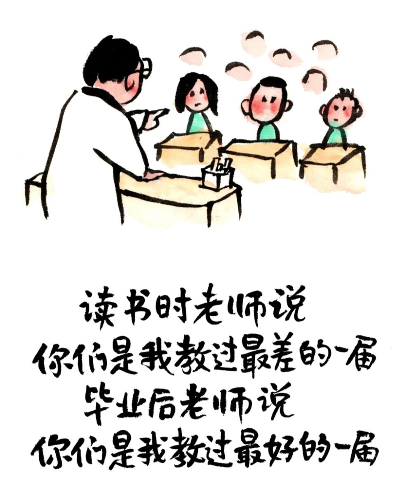
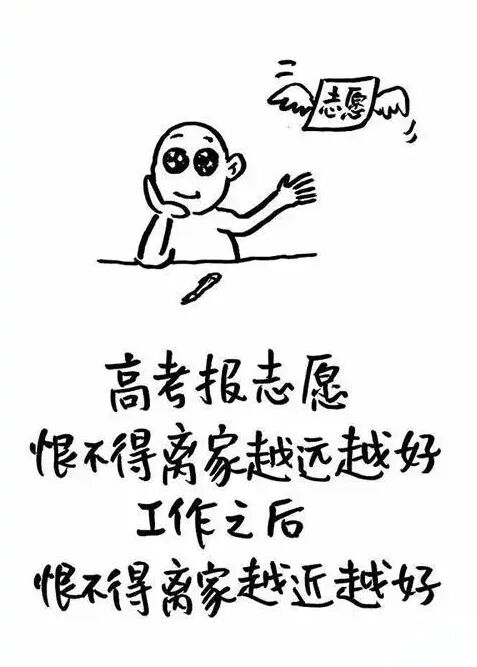
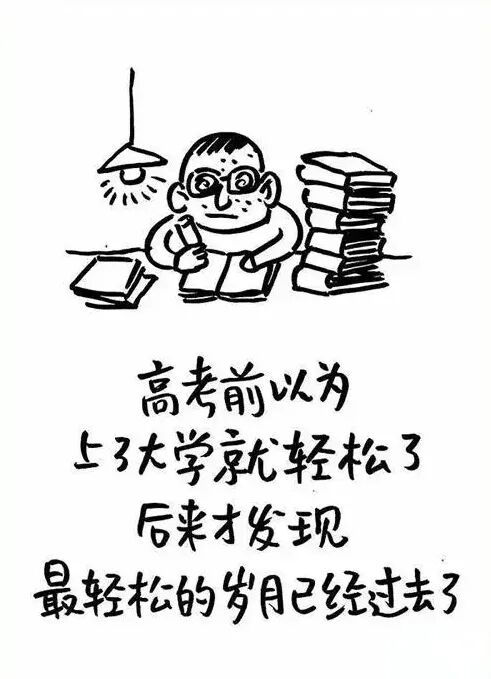

# 小林漫画：那年高考，藏着我们回不去的夏天

- 原文链接：<https://mp.weixin.qq.com/s/g5LhUWrrf-nR8oaF4KQCzg>
- 归档时间：`2026-09-05T14:12:35.930390+08:00`
- 归档范围：已清理署名、二维码、广告、推广和无关装饰后的原文正文。

## 原文正文

那年夏天，暗恋的男生坐在斜前方，他的白衬衫在风扇下被吹得鼓起来，我盯着看了一节课，现在连他名字都想不起来了。

当年嫌校服丑，现在看照片觉得那是穿过最舒适的衣服，不用想搭配，能装下来不及吃的早餐，还能在课桌上趴着午睡。

班主任的那句“你们是我带过最差的一届”，后来成了同学聚会的开场白，大家笑着笑着就沉默了。

原始图片链接：<https://mmbiz.qpic.cn/mmbiz_png/UVsZ2xn51XJIHsVX8fYc1Lu8uhHWs4S3PLXRk0shJFrmy98Zw4bN5sxQydSptnb6qs9d5XD8nImAyy9mBSRFE4TIut6vcPDDz5HEwepOhicc/640?wx_fmt=png&from=appmsg>

那年夏天，班主任考前说“等你们上了大学就轻松了”。后来发现他是骗我们的，大学也要早起、要考试、要抢课，大三还得拼命考研考公，比高中还累。

想做自己，总有人告诉你“等高考完你就自由了”。等高考真的完了，你发现，你想填写一个离家远一点的志愿，爸妈都会把你的划掉，写上他们满意的学校。

毕业照拍完，大家说“常联系”。后来发现“一辈子”在毕业照拍完的那一刻，就按下了快进键。

原始图片链接：<https://mmbiz.qpic.cn/mmbiz_jpg/UVsZ2xn51XLUJAda7eIIdvPXWpX5ZAPxI9N3rEzSTicUCj5Ky3dnIXzx7Q73N7YOD2PoZKZS0wgrfcN3icRbiaD8YSSSMUDSIBCOQB4oEj5oPc/640?wx_fmt=jpeg&from=appmsg>

那年夏天，以为高考是人生最难的门槛。后来才发现，那只是游乐场的入口，里面还有过山车和鬼屋等着你。

现在刷到高考的新闻，还会忍不住点进去看作文题。看完后，庆幸“幸好我毕业早，这题目我连题干都看不懂”。

高考像一场漫长的排队，大家挤在一起等一个检票口，等轮到你时，才发现票上没写目的地。

回不去的不是高考，是那个以为未来有无限可能的、满脑子都是公式和梦想的、被晒得黝黑的夏天。如果有时光机，我想回去告诉那时的自己：别怕，考砸了也能活。

原始图片链接：<https://mmbiz.qpic.cn/mmbiz_jpg/UVsZ2xn51XLnicP92QFtictXtJc3PqBZ75YyGyGbJ16Wzx95iaam0lA27acWWFfwLr8qPYWGvhMia1a2urltboFnibYfVlExWibtVib2pa0QJBAl1s/640?wx_fmt=jpeg&from=appmsg>
