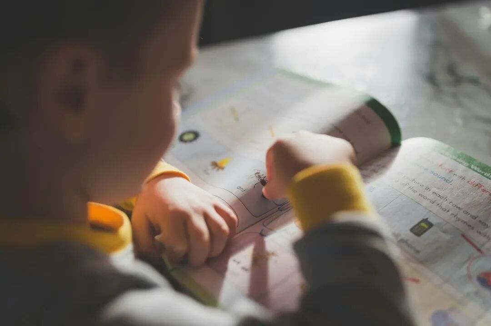

# 那些从不检查作业的妈妈，养出的孩子怎么样了？

- 原文链接：<https://mp.weixin.qq.com/s/gomkgF54MW1c8XyF19jXqQ>
- 归档时间：`2026-09-05T13:47:54.324435+08:00`
- 归档范围：已清理署名、二维码、广告、推广和无关装饰后的原文正文。

## 原文正文

前几天有一位妈妈问我：孩子上四年级了，要不要每天辅导孩子写作业，检查作业？

因为发现孩子期中考试分数下降了很多，老师说孩子平时的作业不是很认真，希望父母重视起来。

真的很着急，本来想放手，让孩子去自己做，对自己负责。

可看样子不行，还是得盯着吗？

真的太累了。

我很理解这位妈妈的心情。

但是，孩子的作业坚决不去盯着写，也不要检查。

因为这些是孩子自己的事。

《小王子》里有一句话：

“如果你想造一艘船，千万不要鼓励人们去伐木、去分配工作、去发号施令，而是要教会他们去渴望大海的无垠和高深莫测”。

让孩子有好的学习态度，比盯着孩子作业要重要得多。

根据孩子的成长节奏，慢慢放手，一步步来。

让孩子自己负责，承担责任。

比如小小鱼的作业，从小学开始，我们就没有盯着他去写。

而是关注老师反馈的结果，过程交给他自己，让他去承担责任。

比如那时老师会标记作业未交、扣1、扣2等。

扣一两分都是可以接受的。

让他自己去改正就好。

不要拿着小板凳坐边上，盯着孩子写作业，只要错了一个地方，马上就指出，要他改。

这样的状态，不仅打搅了孩子的专注力，还会让他们很不自在。

看到结果后，也不要去指责孩子能力，讲事实就好。

题目错了，就讲错题，不要说怎么这都不会啊，怎么总是粗心大意、屡教不改啊。

这些扎人的话，说多了，孩子就会反感。

除非说他的某一科作业没有上交或者没有完成好。

那就会询问一下原因。

是没有做完，还是不会做。

再结合在家里的情况来分析，基本就能弄清楚缘故了。

原始图片链接：<https://mmbiz.qpic.cn/sz_mmbiz_jpg/h2rHib9III37g4IjWN0ywEKyJatvwJCoceQZyOSOib85gVk9P73lKVOKd2VTlcN9fV2lAfwwVWuSPBT7x7O0cNdK6Qo0bCJQdMiaQSVkePTHzk/640?wx_fmt=jpeg&from=appmsg#imgIndex=3>

如今小小鱼读中学，作业都是自己安排，我们周末提醒一下他。

但也不是完全放手，结果还是要看。

比如有一次周末，因为玩电视游戏，整个心都是浮的。

第二天英语老师的反馈就来了，说测试卷做得一塌糊涂，花了多少时间？

老师意思是他不认真，因为以前的作业没有这样的情况。

我跟老师说了情况，也请求老师严加管教。

晚上回家后，也把老师的反馈给他看了。

他自己也知道是没认真，草草了事，就想着去玩。

那结果肯定也要承担。

在学校，老师会处理。

在家里，按我们之前一起定的规矩来，周末的电视取消一次，电视游戏非大节假日不玩。

我跟他说：“现在读初中，爸爸妈妈更加不会盯着你的作业，也不会给你检查，你自己对自己的作业负责，我们会看你的完成情况，还有老师的反馈，希望你自己能认真。”

接下来，就没有这样的情况了。

每次作业都认真地在做，有好几次地理手抄报，还在学校获了奖。

“你看认认真真的对待，还是有好的回报吧，不错不错”

有进步也要及时地去肯定和鼓励他。

哪怕孩子年龄小，也不要替代，让孩子自己去做。

有妈妈会说，孩子小，做的慢，又做不好，看着着急，能不能帮他们一下？

我的建议是尽量不要出手帮忙。

弟弟小谦现在周末看到哥哥做作业，或者我们讨论哥哥的学习。

他就会积极地拿着自己的作业，要我们带他做。

那就是幼儿园的一个数学思维册，大部分是游戏。

所以他的兴趣很高。

这种态度当然是很好的，这是难能可贵的学习种子呢！

我们也会肯定他：“真的不错哦，会主动来完成作业。”

但做的过程中，也会让他自己去涂色、连线或者粘贴小图案。

虽然他很慢很慢，但我知道，这个时候，再慢也要忍住，不要去替代他。

不要怕浪费时间，就让他慢慢地自己完成。

因为现在养成了习惯，到了小学反而能帮我们省很多时间。

他们会自己去做，而不是什么都靠爸爸妈妈帮忙。

原始图片链接：<https://mmbiz.qpic.cn/sz_mmbiz_jpg/h2rHib9III35FV7jbc41V7n1PzptFwNntGIHlyzdJEZnic4cU2Hxbp7VR5RBXp1ibHKgGiaGxGtFUWsBHOYdibSUzaqgOxTfgbLwZvria2iaY5bGlw/640?wx_fmt=jpeg&from=appmsg#imgIndex=6>

激发自驱力，让孩子安排作业时间。

到了中学，随着科目的增加，小小鱼的作业也增加了很多。

这时，我会询问他作业的量，告诉他自己安排好时间。

完成不了，自己负责。

不要担心孩子完成不了，或者去学校挨批评。

他们会想法子去做的。

拖延还是抓进度，完全把握在自己手中。

如果到了中学还要父母盯着做，那孩子就算成绩好，也是暂时的。

一旦离开了父母的掌控，他们就不知所措，适应不了。

那不如早点让孩子自己去做主，去把控。

这个过程可能没那么顺利，但终究还是要去做。

现在小小鱼把自己的作业时间安排得不错。

虽然有时还是会手忙脚乱，会跟我说有点累啊。

但积累下来后，会越来越顺利。

那些从不检查作业的妈妈，养出的孩子怎么样了？

我想，不盯着、不检查孩子作业，肯定也不等于不管。

只是父母学会放下了内心的焦虑、让孩子学会承担、去信任孩子。

孩子也会多一些学习的自驱力，一个好的学习态度和习惯。

而孩子从小养成的观念和习惯，会一直跟随他们的整个成长过程。
