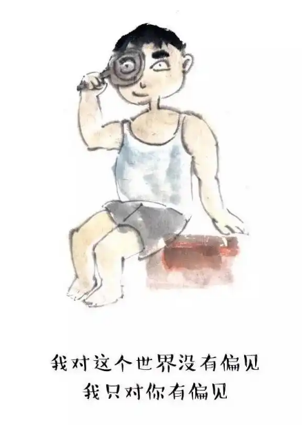
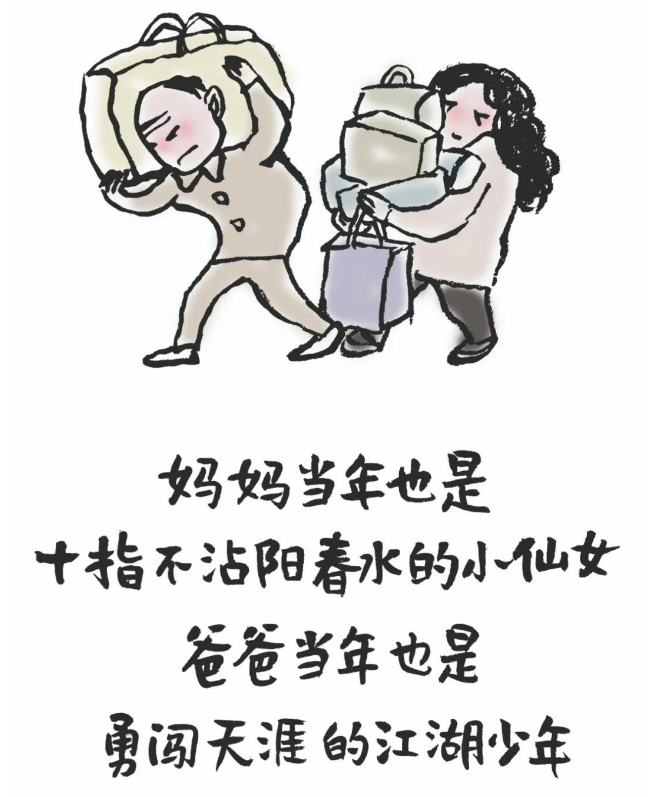
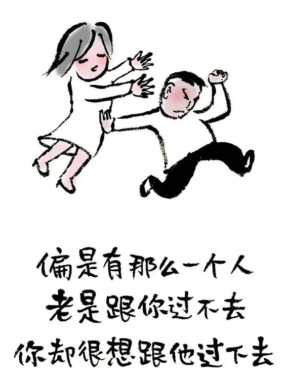

# 小林漫画：一个家，别总是在较劲

- 原文链接：<https://mp.weixin.qq.com/s/aze1Gf7Xk_nGHZJjrzFYnQ>
- 归档时间：`2026-09-05T13:26:28.465358+08:00`
- 归档范围：已清理署名、二维码、广告、推广和无关装饰后的原文正文。

## 原文正文

我见过最累的家，不是穷的，不是病的，是天天在较劲的。

你嫌他拖鞋乱扔，他嫌你东西乱放。你说他回家太晚，他说你做饭太咸。你说周末去哪玩，他说你选的地方都没意思。你跟他说东，他非要说西。你跟他说A，他非要证明B才对。

这个家变成了一个辩论场。谁也说服不了谁，谁也没打算让。较劲这个东西，在单位叫据理力争，在家里叫吃饱了撑的。

我见过一对夫妻，吵了三十年，从结婚第一年吵到孙子出生。

吵什么？吵的是“当年结婚的时候你家少给了多少彩礼”“你妈当年对我怎么样”“你那次说那句话什么意思”。每一个话题都能追溯到二十年前。

你问他们还爱吗？不知道。但他们记性真好，二十年前的事一字不差。

原始图片链接：<https://mmbiz.qpic.cn/mmbiz_png/UVsZ2xn51XJHRfMuVYZ1iaOUiaP4iaC3X6LSDaWPMCLjLFhtpibla7CgUbmaAEU3pgF4TApeWfjibBlzKxcNEo8plRHVa2p1TrgcSk9JNv9Fv68A/640?wx_fmt=png&from=appmsg>

02

一个家不需要法官，需要的是糊涂。

她做饭咸了，你别说“咸死了”，你说“今天盐便宜是吗”。他拖鞋乱扔，你别吼“跟你说多少遍了”，你自己捡起来放好，下次再说。孩子考差了，你别拍桌子，你让他自己把卷子拿出来看看错哪了。你们的目标不是“赢”，是“过下去”。

一个家最大的福气，不是有钱，不是有房，是没有人在家里较劲。

你在外面已经跟客户争、跟老板扛、跟同事比，回来就想喘口气。你要是回来还得继续跟家里人打仗，你这口气什么时候才能喘？所以我现在特别佩服那种“打哈哈”的人。你说什么他都“嗯嗯”点头，你问他意见他说“都行”，你跟他发火他说“你说得对”。

他不是没脾气，是他把脾气留给了外面。他愿意在家里装糊涂，是因为他珍惜这个家。珍惜的人，才肯认输。较劲的人，往往最后什么都没剩下。

一个家，别太较劲了。赢的那点道理，比不过输掉的感情。

原始图片链接：<https://mmbiz.qpic.cn/sz_mmbiz_png/UVsZ2xn51XK71XLkB7iaDwVrWHdlibcxmVJFYicMBNz78hNhZ3zXRcicDYeB4b8rNYXUJYKdAmBKDExxVeZerhW8icPsWY94gQlLuYxIBMBCGiaAM/640?wx_fmt=png&from=appmsg>

03

我现在对自己有一个要求：回到家，就不争论。

老公说“这个菜不好吃”，我说“那下次换一家”。孩子说“我不想学这个”，我说“那你想想想学什么”。老妈说“你那个方法不对”，我说“嗯，你的方法也挺好”。

不是没有意见，是不想把家变成一个战场。

一个家最大的问题，不是谁对谁错，是谁都不肯先闭嘴。他觉得他有理，她觉得自己没错。他等着她服软，她等着他低头。最后谁也不低头，谁也不服软。孩子看着，老人听着，日子僵着。

家里不是讲理的地方，是讲情的地方。你非要把理讲清楚，情就没了。情没了，家就散了。

原始图片链接：<https://mmbiz.qpic.cn/mmbiz_png/UVsZ2xn51XIlYwmwdw6FsOeqdQdibKyuoiaNlpSq6cBVGBvnbzvTvgd5E2p1iay7IhjEltHTc9UIvMdMrBx80f9z2BVtY8RiccPBTI7nDicPm2Mk/640?wx_fmt=png&from=appmsg>
