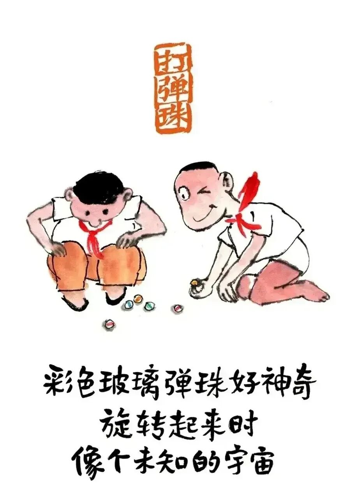
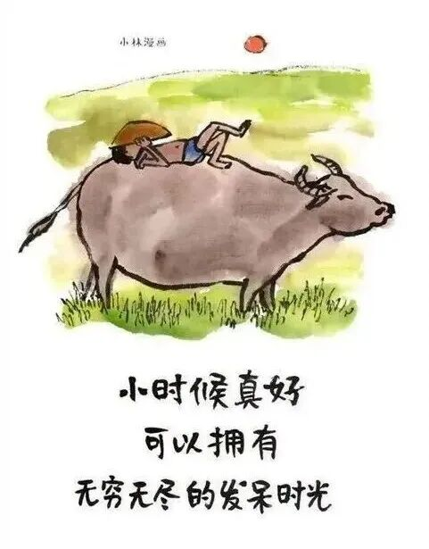
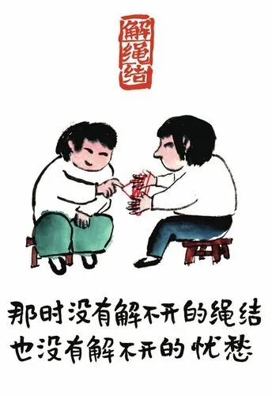

# 小时候最想逃离的地方，长大后拼了命也回不去了

- 原文链接：<https://mp.weixin.qq.com/s/oRK9BOvbw6PgIYN0hpeW8A>
- 归档时间：`2026-09-05T13:39:47.146689+08:00`
- 归档范围：已清理署名、二维码、广告、推广和无关装饰后的原文正文。

## 原文正文

01

小时候的日子

很慢

一包零食

能开心一下午

放学路很短

却总走很久才到家

那时候的烦恼

也很小

哭一会儿

就过去了

原始图片链接：<https://mmbiz.qpic.cn/mmbiz_jpg/UVsZ2xn51XIToYfw7XqU6vmP2BTuzDbxWm1Q9DiaicOpuOl3Vcbx3wZSBJnSf35WFM2mxXgSiaricmVPU27rWP6zqpicNCycDzR4B3LXekM4vaXA/640?wx_fmt=jpeg&from=appmsg>

02

小时候盼长大

觉得长大了

就自由了

可以买喜欢的东西

可以去想去的地方

后来真的长大了

却开始怀念

怀念没有选择的时候

怀念被叫回家吃饭的时光

怀念有人替你做决定的日子

原始图片链接：<https://mmbiz.qpic.cn/mmbiz_jpg/UVsZ2xn51XKkkPN6Jz9l7srM9TibLnicoh5ddltkb4hTVnTx88hUslGPtW1ibSjoJWAwJgDg2ap5SH1wgcnNXcw7MiaibMMvt3Ajj4RibYPxa5X6M/640?wx_fmt=jpeg>

03

我们怀念的

从来不是时间

是那个没被生活推着走的自己

是不用权衡、不用硬撑的状态

回不去没关系

但可以活得像一点点小时候

简单一点

慢一点

偶尔为一件小事开心

也允许自己

什么都不做

原始图片链接：<https://mmbiz.qpic.cn/mmbiz_jpg/UVsZ2xn51XLVicnEL2SsbtqEYZgxmTXq08svAkpCYruHZ0P9laEyEZR9l3qxaE6iaewJM1nMZ3lLXAAsviatlfsp94REE49wDulg5ahx9X4TP0/640?wx_fmt=jpeg&from=appmsg>
