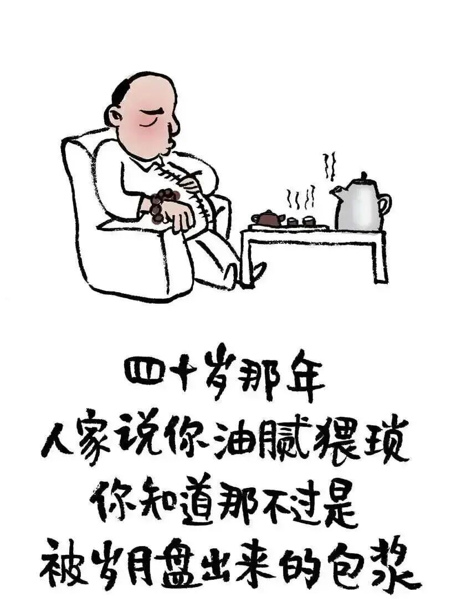
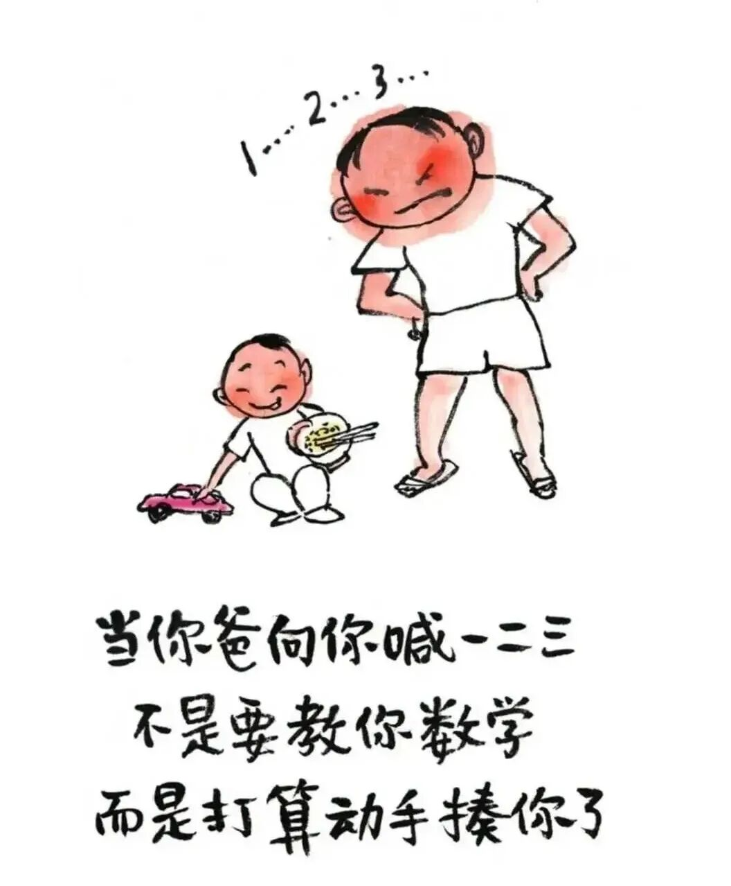
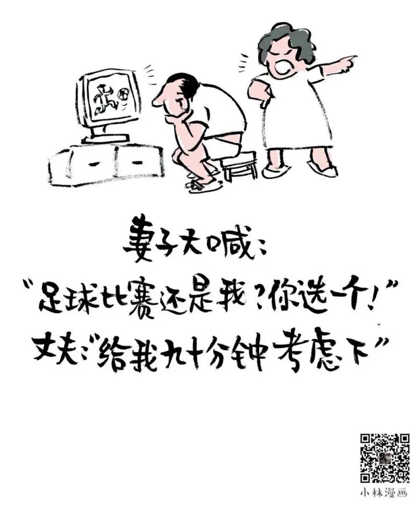
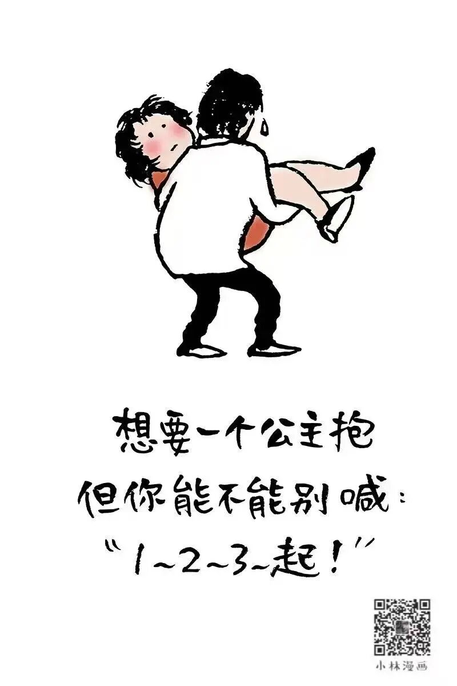

# 小林漫画：中年男孩的正确打开方式

- 原文链接：<https://mp.weixin.qq.com/s/Z3jYBt4q8miyVd_eO4EcsA>
- 归档时间：`2026-09-08T14:33:53.109344+08:00`
- 归档范围：已清理署名、二维码、广告、推广和无关装饰后的原文正文。

## 原文正文

01

体检报告出来

脂肪肝、高血压、尿酸高

他说

“没事”

“哪个中年男人没三高”

然后偷偷把啤酒换成了枸杞水

喝了一口说“真难喝”

原始图片链接：<https://mmbiz.qpic.cn/mmbiz_jpg/UVsZ2xn51XKNGN3np3tiaH9T9ITD8DY8HVjYCoajGyRr8WELhJiaXuk2mX3icTsrVnIWlue2QqQb78Q2ibntPy88SghyiavaQ39lZdZq4csciaAFg/640?wx_fmt=jpeg>

02

孩子说

“爸，你头发又少了”

他摸了一下头说

“我这是聪明绝顶”

孩子说

“那你聪明吗”

他说

“聪明人不会跟你争这个”

原始图片链接：<https://mmbiz.qpic.cn/sz_mmbiz_jpg/UVsZ2xn51XJdaR2c8a3gSvhumYEgsoB4ChJXKAIALrOm8nHjMWkwA9qP7sPDia30I0319ViabqSicA7jxwian4bFJSPP5nMJmR6fCaJjmicc13jM/640?wx_fmt=jpeg>

03

朋友约他去钓鱼

他说“行”

到了河边坐了一整天

一条没钓着

朋友问“你不着急吗”

他说

“钓鱼不是目的，躲清静才是”

回家就和老婆说

“今天收获满满”

老婆问“鱼呢”

他说“放生了”

原始图片链接：<https://mmbiz.qpic.cn/sz_mmbiz_jpg/UVsZ2xn51XJPjNcv3MicSIE7H1EsK8NicibcdwxGg6icStdD01VISvqbkXKFD5e3IAz4HmVocLZlI5UtyktWLzgBuI0mF2u7w6icO2cfxZKrjuJ0/640?wx_fmt=jpeg>

04

中年男孩的正确打开方式

就是

心里住着一个少年

身体却住着一个老头

嘴上说“我还年轻”

腰说“你骗谁呢”

最后跟身体妥协

跟生活和解

跟老婆说“你说得都对”

原始图片链接：<https://mmbiz.qpic.cn/sz_mmbiz_jpg/UVsZ2xn51XIh4mwJFfR3q7jYWLa8uktvpO7lfjX1kxfLSmkADc7A4EPIPUzqUQicUYqvToRVLk56jHsuys4hVW7UDIaibKYc3wcJIHawiaiczII/640?wx_fmt=jpeg&from=appmsg>
