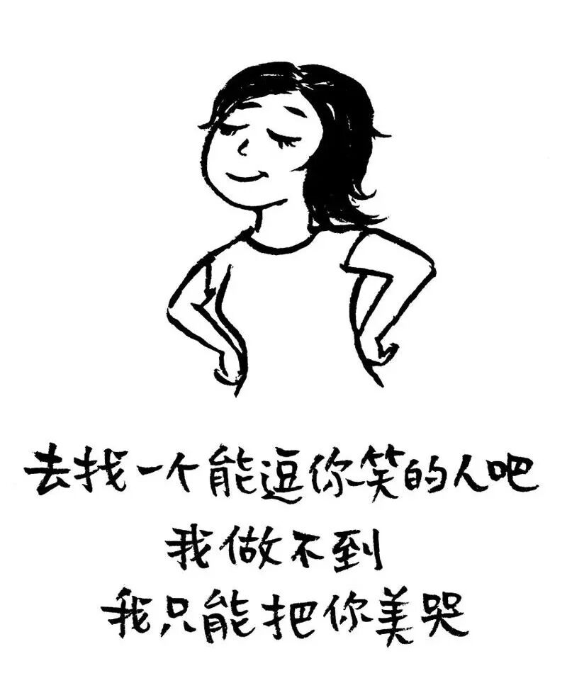
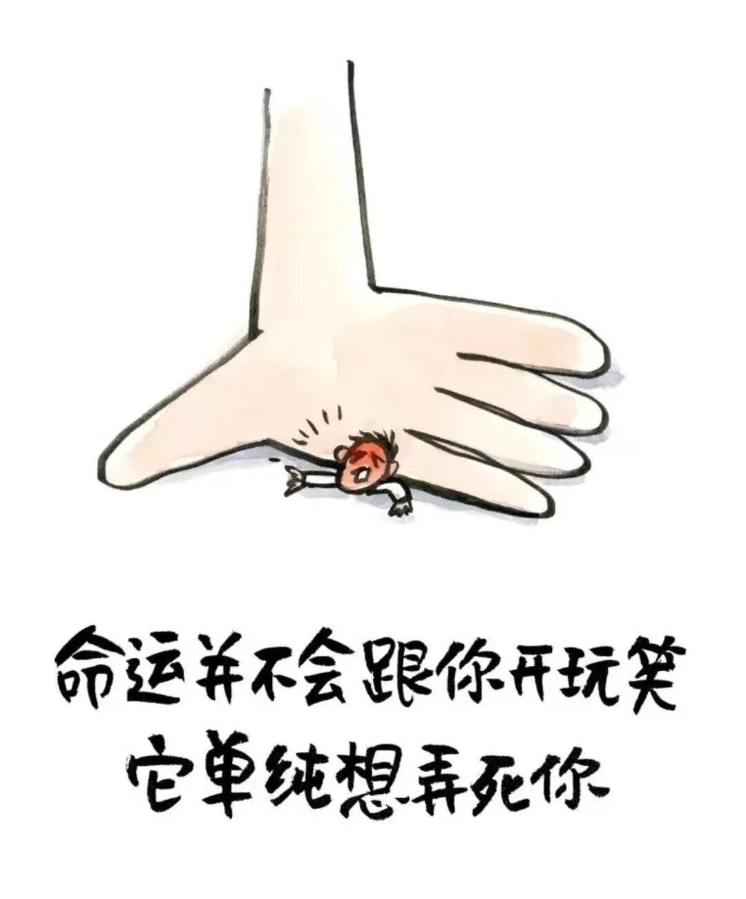
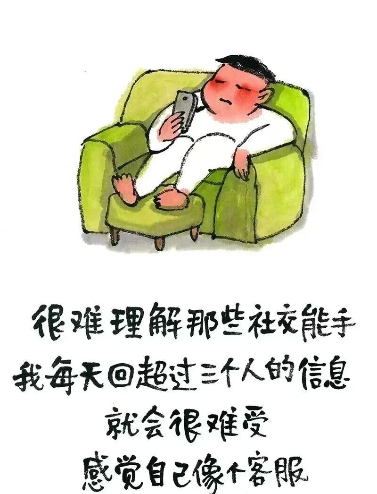

# 小林漫画：千万不要当别人的“垃圾桶”

- 原文链接：<https://mp.weixin.qq.com/s/__SOmAXvnD6hHRbG2euhpQ>
- 归档时间：`2026-09-08T14:25:28.574192+08:00`
- 归档范围：已清理署名、二维码、广告、推广和无关装饰后的原文正文。

## 原文正文

01

同事每天午休准时找我倒苦水，说她婆婆又作妖了，我边听边点头，她吐完一身轻松去午睡，我消化不良，下午开会脑子全是她婆婆的脸。

闺蜜失恋哭诉到凌晨两点，我陪骂渣男、递纸巾、点外卖，第二天她说“想通了”，然后去跟渣男复合了，我的黑眼圈留了一个礼拜。

邻居大姐见我就讲她老公的坏话，从袜子乱扔到不管孩子，我听着听着觉得自己老公也不顺眼了，回家差点吵一架，她倒好，说完心不堵了。

原始图片链接：<https://mmbiz.qpic.cn/mmbiz_jpg/UVsZ2xn51XLQaEYXOhE4iaR0MhibSicHxv4tyEoj3TkCP9tULXdSZNbT97K4ibPZh3kPtg7OjUj90mjwXaoWHNoVIWCtxDUy7hD8CUqzqOibicd8I/640?wx_fmt=jpeg>

02

亲戚群里的长辈每天转发“震惊体”养生文，还艾特我“快看”，我回“好的”，他们满意了，我的血压和手机内存一起飙高。

网上一个不太熟的朋友，半夜发大段语音说人生没意义，我打了长文回复，他说“谢谢”，第二天又发“还是想死”，我成了他的情绪托管所。

后来我学会了设置消息免打扰，午休戴上耳机听相声，同事张嘴我就“嗯嗯”，她说完我不往心里去，下午上班脑子清净。

原始图片链接：<https://mmbiz.qpic.cn/sz_mmbiz_jpg/UVsZ2xn51XLo6kh8a8eIcsdzEYxpv7sXAm5QYuiaKHyMnh8NqM1pZnAYmVGLt2iaYmic8otFux1FvJj8tAICH7Awmq9hXheiaQLfF8ngia8Tsego/640?wx_fmt=jpeg>

03

闺蜜再来哭诉，我给她推荐了心理咨询热线，说“专业的比我管用”，她愣住，我说“收费的才认真听”，她笑了，我也笑了。

你以为你是在倾听，其实你是在替别人得病，他们倾诉完了，病传染给你了，你还得自己买药。

当别人的垃圾桶，你以为是在做善事，其实是在吸尾气，他们排完毒一身轻，你积了一肚子废气，打嗝都是苦的。

原始图片链接：<https://mmbiz.qpic.cn/mmbiz_jpg/UVsZ2xn51XKkVOtfeqSgibPBibicBMP6Xe51Iibev1aMkrt3sSyWTdovoib0GyjeUErc3zalVMu5SicFBadbb2XHIHEHIMmxFia79h88n6jFibVJld0/640?wx_fmt=jpeg>
