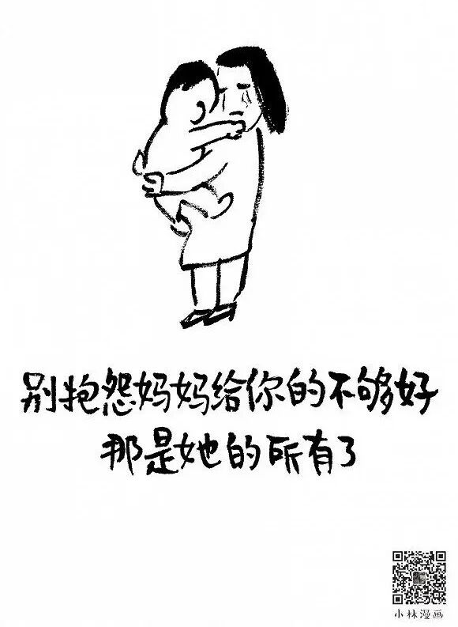
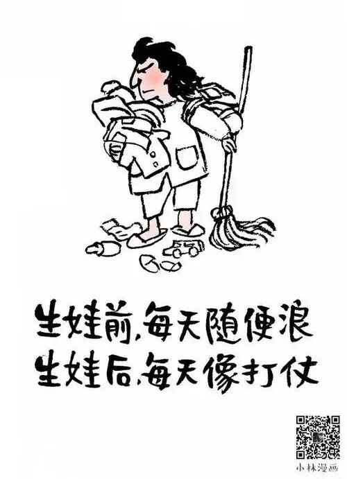
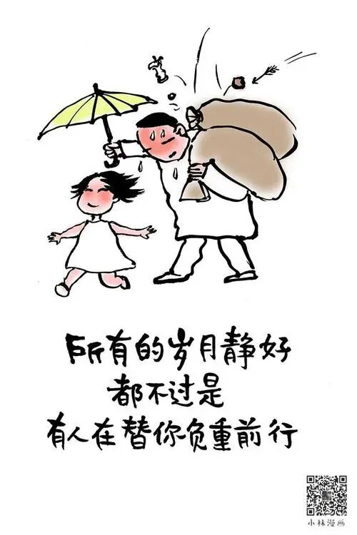

# 一个人生建议：不做“满分妈妈”

- 原文链接：<https://mp.weixin.qq.com/s/EJpy1a-2vV54ReeQgw7b4w>
- 归档时间：`2026-09-08T14:22:39.941779+08:00`
- 归档范围：已清理署名、二维码、广告、推广和无关装饰后的原文正文。

## 原文正文

01

运动会要求家长参加拔河

我请了半天假去了

结果输了

孩子气呼呼地对我说

“妈妈你怎么不用力”

我说“我用力了啊，吃奶的劲都使上了”

他说“那为什么输了”

我说“因为对面的妈妈比你妈胖”

原始图片链接：<https://mmbiz.qpic.cn/sz_mmbiz_jpg/UVsZ2xn51XKt6k8TsUTNBsowwVV4ZfRPHohzj2lB3QTkacib6mOTGa16Z4xiaric6TzbamDiaeBN68icFtZHndwDPlic79ZUd0hgL0ETiadf6RlQIk/640?wx_fmt=jpeg>

02

有一次

我学着网上的食谱做了个卡通便当

花了两个小时

孩子打开说章鱼香肠的眼睛歪了

我说歪了也能吃

他说不行

逼我重做

我说你再这样明天带白米饭

最后

他吃完了

原始图片链接：<https://mmbiz.qpic.cn/sz_mmbiz_jpg/UVsZ2xn51XIhMmD6pfGicvDvJBeuIt24KXO0mn69iacRopdr2RBzBnm1HNbMDfGsOcpDXUQxPuxqQtLoLVoMITTQPX62PvowEzAIxT8lEJhag/640?wx_fmt=jpeg>

03

满分妈妈的标准是：

手工要精致

便当要可爱

作业要全对

家长会要积极

脾气要温柔

还要赚得到钱

我一个都不沾

我只有一条

我健康活着

孩子也健康活着

与其得乳腺增生、甲状腺结节、抑郁症

不如做个六十分妈妈

省下的四十分

用来爱自己

原始图片链接：<https://mmbiz.qpic.cn/mmbiz_jpg/UVsZ2xn51XJr02VjF0sVcibrOGG9tXOgicugqs9AicwCBYOY92wYSEYBl7O7tPIsJW7n5LO7hTWDsuBGrdiaibIxtlTd14bLg0Bw9620xDSNyl54/640?wx_fmt=jpeg&from=appmsg>
