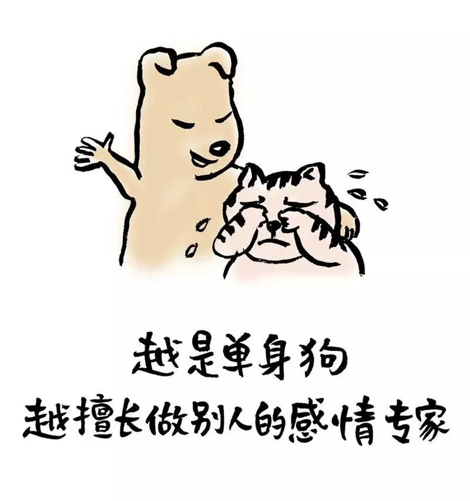
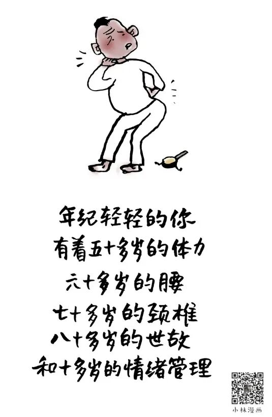
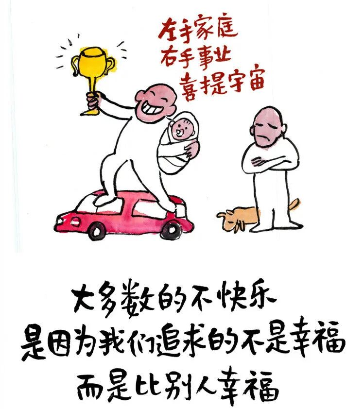

# 小林漫画：人“俗”一点，才会更开心

- 原文链接：<https://mp.weixin.qq.com/s/J32KgaMkJzbDJFEsqj1lGw>
- 归档时间：`2026-09-08T14:22:43.902989+08:00`
- 归档范围：已清理署名、二维码、广告、推广和无关装饰后的原文正文。

## 原文正文

01

以前觉得吃路边摊太丢人，现在蹲在马路边三轮车附近啃烤面筋，辣椒粉糊了一嘴，老公说“你注意点形象”，我嘚瑟的说“形象能当串儿撸吗”。

以前发朋友圈必须凑满九宫格，再配上精心挑选的文艺感十足的文案，现在直接拍碗热气腾腾的炸酱面，简单配文“香死了”，点赞反而比以前多，原来大家都爱看真实的烟火气。

以前跟朋友聊天，不是人生哲学就是远大的梦想，现在聚一起直接吐槽“你老公昨天又打呼了？”“你家孩子考了多少分？”聊完一身轻松。

以前同事聊八卦我躲着走，现在凑过去一脸天真的问“谁？哪个部门的？真的假的？”听完心满意足地回去干活。

原始图片链接：<https://mmbiz.qpic.cn/mmbiz_jpg/UVsZ2xn51XLWhRHRwXB4EJkLe3EjlbCUx9iabR8ibY4E2TXzsleia4h3muOjlTkYyhRSC5icnia6K3ApjMibXGQMO6fZvX2zib7TSTUlIEdicZQF3V4/640?wx_fmt=jpeg>

02

以前周末必去美术馆装文化人，现在逛菜市场扯着嗓门跟卖菜大妈砍价，省下五毛钱买根葱，心里美滋滋的很。

以前买花要进口的、名字洋气的，现在菜市场十块钱一束的小雏菊，插在玻璃醋瓶子里，觉得比任何高级花艺都顺眼。

以前喝茶讲究紫砂壶、野生高档茶，现在直接保温杯泡枸杞，加点西洋参，喝一口，觉得身体倍儿棒。

以前听歌必须民谣、爵士，显得有品位、有格调，现在车里放凤凰传奇，跟着唱“苍茫的天涯是我的爱”，脚丫子跟着打拍子，吼两嗓子，心情别提多爽了。

原始图片链接：<https://mmbiz.qpic.cn/sz_mmbiz_jpg/UVsZ2xn51XLFg9y05K00d4b2HHrm3GcqNrREKx6gF5KcgZJZjwODyFNKxIontmokibONZSiagHNuTEYtdianiaeF76IoekIxcAbxibDibGUFQUmRs/640?wx_fmt=jpeg&from=appmsg>

03

以前觉得自己得高雅、深刻、脱俗、有内涵，结果累得失眠、便秘、内分泌失调。后来学会了大口吃肉、大声放屁、大白天躺沙发追剧，病全好了，老中医说“你这是悟了”。

以前觉得“俗气”是贬义词，现在觉得“俗气”是护身符，俗了就不会被人架在高处下不来，俗了就不会放弃体验普通人吃喝玩乐的快感。

你看公园里那些老太太，跳广场舞、唠家常、抢特价鸡蛋，哪个不比坐在咖啡馆里装忧郁的年轻人快乐。

俗，就是承认自己是个普通干饭人，不端着，不装着，不绷着，肚子饿了就吃，困了就睡，开心就笑，这才叫活着。

俗，就是放下“体面”的包袱，敢说人话，敢做人事，敢骂街也敢认怂，社交不累，关系不假。

俗，不是什么低级趣味，是落地，是生根，是从云端回到地面，脚踏实地，鼻子能闻到炸酱面香。所以，别装了，俗一点，再俗一点，开心了，健康了，和周围也融了。

原始图片链接：<https://mmbiz.qpic.cn/sz_mmbiz_jpg/UVsZ2xn51XJZS0QI17PrDic8jtuLwFLd7aQauX07eRSHFh6MVia9zIdPFqMg2icQFEenMKtOy1rqLZ8UcVWTDPGWnZH9Uns3kAgibrpwOfhgS8w/640?wx_fmt=jpeg&from=appmsg>
